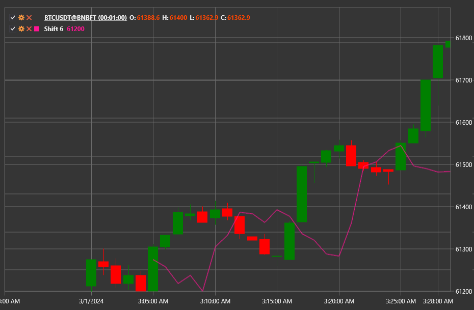

# Shift

**Shift** — вспомогательный индикатор, который сдвигает исходный поток значений на заданное количество периодов. Он не изменяет
данные и не выполняет математических преобразований, а лишь обеспечивает выравнивание или задержку сигналов в составных
расчётах.

Для использования индикатора необходимо применять класс [Shift](xref:StockSharp.Algo.Indicators.Shift).

## Описание

Индикатор хранит буфер последних значений и выдаёт значение, которое было получено **Length** баров назад. Если доступных данных
меньше, чем требуется для сдвига, результат считается неопределённым.

## Параметры

- **Length** — количество периодов, на которое нужно сместить данные.

## Использование

- Согласование сигналов разных индикаторов во времени.
- Построение пользовательских индикаторов и стратегий, где требуется задержка входных данных.
- Создание синтетических серий, например, для вычисления разницы между текущими ценами и значениями в прошлом.

## См. также

[PassThrough](pass_through.md)
[Sum](sum_n.md)
