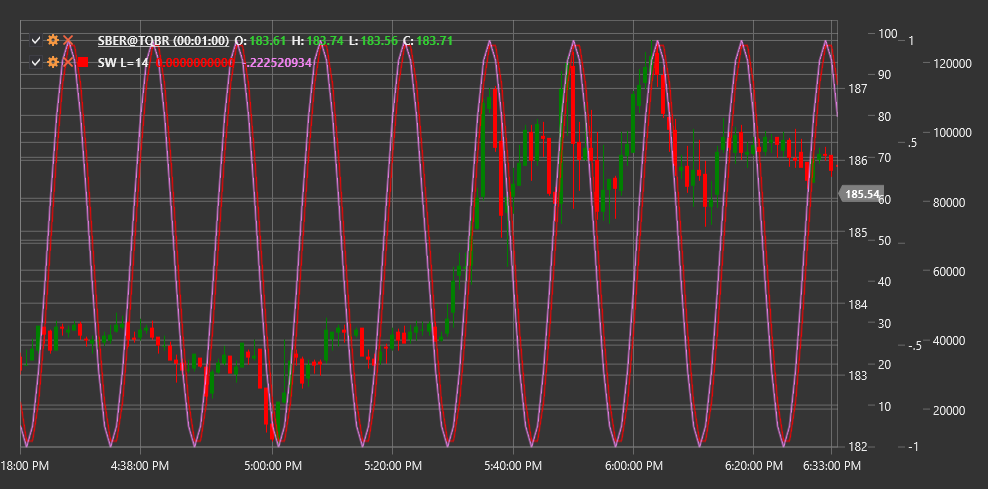

# SW

**Синусоида (Sine Wave, SW)** - это технический индикатор, который использует математическую функцию синуса для определения циклических паттернов в ценовом движении. Индикатор стремится идентифицировать и предсказать периодические колебания рынка.

Для использования индикатора необходимо использовать класс [SineWave](xref:StockSharp.Algo.Indicators.SineWave).

## Описание

Индикатор Sine Wave основан на идее, что рыночные движения имеют циклический характер и могут быть смоделированы с помощью синусоидальных функций. Этот индикатор особенно полезен на рынках, которые движутся в боковом диапазоне или имеют предсказуемые циклические колебания.

Основные характеристики индикатора:
- Помогает идентифицировать возможные точки разворота рынка
- Позволяет определить текущее положение в цикле
- Может использоваться для прогнозирования будущих ценовых движений

Сигналы индикатора:
- Потенциальная покупка, когда линия синусоиды достигает минимума и начинает разворачиваться вверх
- Потенциальная продажа, когда линия достигает максимума и начинает разворачиваться вниз

## Параметры

- **Length** - период синусоидального цикла, определяющий длину цикла в ценовых барах.

## Расчет

Расчет индикатора Sine Wave основан на использовании функции синуса и определении доминирующего цикла в ценовом движении:

1. Определение доминирующего цикла с помощью спектрального анализа или другого метода выявления цикличности.

2. Применение функции синуса для моделирования выявленного цикла:
   ```
   SineWave(t) = A * sin(2π * t / Length + φ)
   ```
   где:
   - A - амплитуда (высота волны)
   - t - текущее время или бар
   - Length - длина цикла
   - φ - фазовый сдвиг для выравнивания синусоиды с фактическим ценовым циклом

3. Дополнительно может рассчитываться индикатор лида (Lead), который опережает основную синусоиду на четверть цикла:
   ```
   Lead(t) = A * sin(2π * t / Length + φ + π/2)
   ```

Индикатор может включать в себя дополнительные компоненты, такие как линия тренда или фильтр, для улучшения точности сигналов.



## См. также

[Цикл Шаффа](schaff_trend_cycle.md)