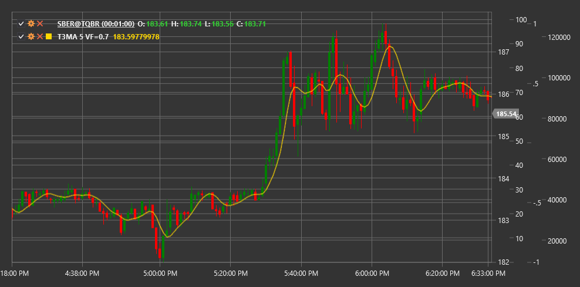

# T3MA

**Скользящая средняя T3 (T3 Moving Average, T3MA)** - это усовершенствованный тип скользящей средней, разработанный Тимом Тиллсоном. T3 представляет собой трижды сглаженную экспоненциальную скользящую среднюю (EMA) с фактором объема, что делает ее более гладкой и менее подверженной ложным сигналам по сравнению с традиционными скользящими средними.

Для использования индикатора необходимо использовать класс [T3MovingAverage](xref:StockSharp.Algo.Indicators.T3MovingAverage).

## Описание

T3 Moving Average разработана для устранения недостатков традиционных скользящих средних, таких как запаздывание и ложные сигналы. Благодаря множественному сглаживанию и регулируемому фактору объема, T3MA обеспечивает более плавную кривую, которая более точно следует за ценовым трендом.

Основные преимущества T3MA:
- Меньшее запаздывание по сравнению с обычными скользящими средними
- Более гладкая кривая с меньшим количеством ложных сигналов
- Адаптивность к различным рыночным условиям благодаря настраиваемому фактору объема

T3MA можно использовать для:
- Определения направления тренда
- Поиска точек входа и выхода при пересечении ценой линии индикатора
- Построения торговых систем на основе пересечения нескольких T3MA с разными периодами

## Параметры

- **VolumeFactor** - фактор объема, определяющий степень сглаживания (обычно используется значение от 0 до 1, рекомендуемое значение 0.7).
- **Length** - период расчета, аналогичный периоду в обычных скользящих средних.

## Расчет

Расчет T3 Moving Average выполняется в несколько этапов:

1. Рассчитываются шесть последовательных экспоненциальных скользящих средних с одинаковым периодом:
   ```
   EMA1 = EMA(Price, Length)
   EMA2 = EMA(EMA1, Length)
   EMA3 = EMA(EMA2, Length)
   EMA4 = EMA(EMA3, Length)
   EMA5 = EMA(EMA4, Length)
   EMA6 = EMA(EMA5, Length)
   ```

2. На основе полученных EMA и фактора объема вычисляется T3:
   ```
   c1 = -VolumeFactor^3
   c2 = 3 * VolumeFactor^2 + 3 * VolumeFactor^3
   c3 = -6 * VolumeFactor^2 - 3 * VolumeFactor - 3 * VolumeFactor^3
   c4 = 1 + 3 * VolumeFactor + VolumeFactor^3 + 3 * VolumeFactor^2
   
   T3 = c1 * EMA6 + c2 * EMA5 + c3 * EMA4 + c4 * EMA3
   ```

При VolumeFactor = 0, T3 становится эквивалентной EMA3 (тройная EMA). При VolumeFactor = 1, T3 максимально сглаживается.



## См. также

[EMA](ema.md)
[DEMA](dema.md)
[TEMA](tema.md)