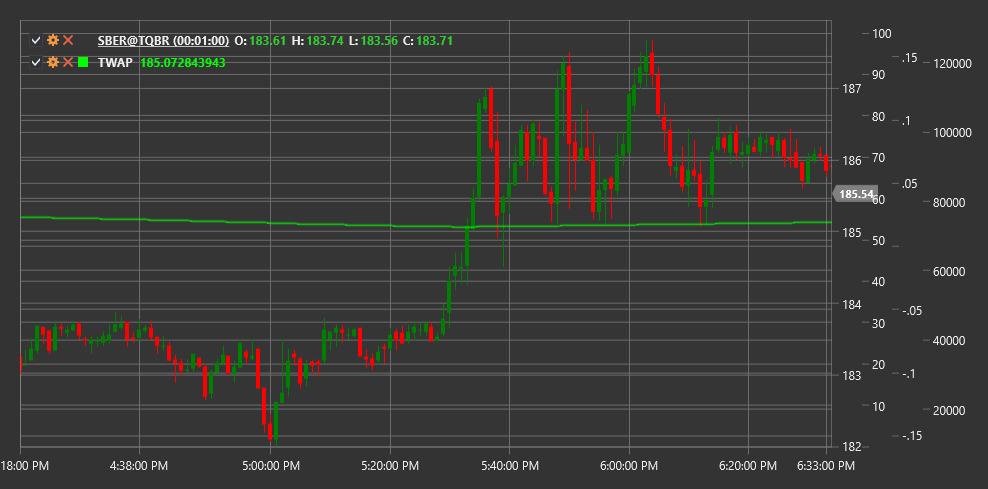

# TWAP

**Средневзвешенная по времени цена (Time-Weighted Average Price, TWAP)** - это индикатор, который рассчитывает среднюю цену финансового инструмента, взвешенную по времени, в течение определенного периода. TWAP широко используется институциональными инвесторами для исполнения крупных ордеров с минимальным влиянием на рынок.

Для использования индикатора необходимо использовать класс [TimeWeightedAveragePrice](xref:StockSharp.Algo.Indicators.TimeWeightedAveragePrice).

## Описание

TWAP является одним из наиболее распространенных алгоритмов исполнения ордеров, который разбивает крупный ордер на серию меньших ордеров, равномерно распределенных по времени. Цель TWAP - получить среднюю цену за определенный временной интервал, минимизируя воздействие на рынок.

Основные применения TWAP:
- Эталонная цена для оценки качества исполнения ордеров
- Алгоритм исполнения для минимизации рыночного воздействия
- Инструмент для рыночного анализа и принятия торговых решений

В отличие от VWAP (средневзвешенной по объему цены), TWAP не учитывает объемы торгов, а фокусируется исключительно на временном аспекте.

## Расчет

Расчет TWAP осуществляется путем суммирования цен на равных временных интервалах и деления этой суммы на количество временных интервалов:

```
TWAP = (P₁ + P₂ + P₃ + ... + Pₙ) / n
```

где:
- P₁, P₂, ..., Pₙ - цены в последовательные моменты времени
- n - количество временных интервалов

В практической реализации чаще всего используются типичные цены для каждого периода (свечи):

```
Типичная цена = (High + Low + Close) / 3
TWAP = Сумма(Типичная цена) / Количество периодов
```

Также для определения текущего значения TWAP в режиме реального времени может использоваться рекуррентная формула:

```
TWAP(текущий) = (TWAP(предыдущий) * (n-1) + P(текущий)) / n
```

где n - количество наблюдений в окне TWAP.

