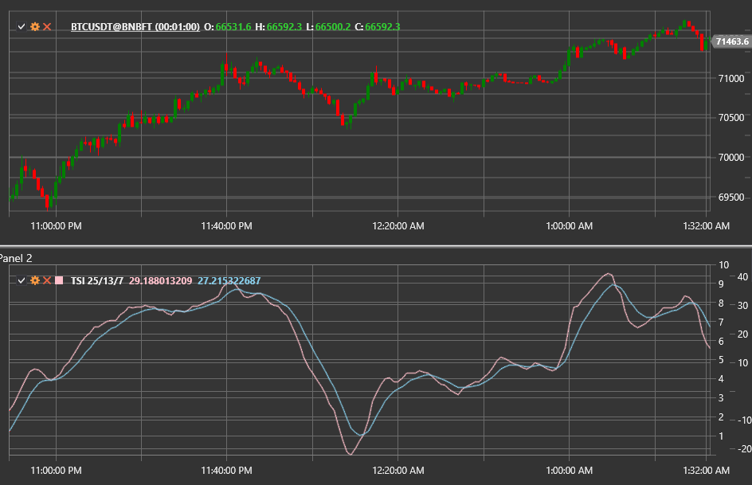

# True Strength Index

**True Strength Index (TSI)** — индикатор импульса, разработанный Уильямом Блау. Он основывается на двойном сглаживании разницы
между последовательными ценами закрытия и помогает выявлять тренды и точки разворота с меньшим лагом, чем у классических
осцилляторов.

Для использования индикатора необходимо применять класс [TrueStrengthIndex](xref:StockSharp.Algo.Indicators.TrueStrengthIndex).

## Расчёт

1. Вычисляется изменение цены `m = Close − PreviousClose`.
2. Значения `m` и `|m|` последовательно сглаживаются двумя экспоненциальными средними с периодами `Length1` и `Length2`.
3. True Strength Index равен отношению двойного сглаженного импульса к двойному сглаженному абсолютному импульсу:  
   `TSI = 100 × EMA(EMA(m, Length1), Length2) / EMA(EMA(|m|, Length1), Length2)`.
4. Дополнительно рассчитывается сигнальная линия — EMA от TSI с периодом **Signal**.

## Параметры

- **Length1** — период первого сглаживания импульса.
- **Length2** — период второго сглаживания.
- **Signal** — период сигнальной линии (опционально, если используется в стратегии).

## Интерпретация

- **TSI > 0** — импульс направлен вверх, доминируют покупатели.
- **TSI < 0** — импульс направлен вниз, доминируют продавцы.
- **Пересечение TSI и сигнальной линии** — потенциальный сигнал на покупку или продажу.
- **Дивергенции** между TSI и ценой предупреждают о возможном развороте тренда.

Индикатор сочетает сглаживание и нормализацию, что снижает влияние случайных колебаний и упрощает интерпретацию в сравнении с
классическим моментумом.

## См. также

[Momentum](momentum.md)
[MACD](macd.md)
[RSI](rsi.md)
