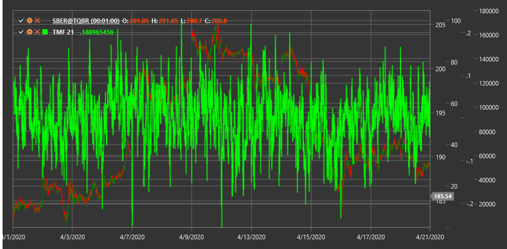

# TMF

**Денежный поток Твиггса (Twiggs Money Flow, TMF)** - это индикатор объема, разработанный Колином Твиггсом как усовершенствованная версия индикатора Чайкина Money Flow. TMF более чувствителен к изменениям рыночного настроения и имеет меньшее количество ложных сигналов.

Для использования индикатора необходимо использовать класс [TwiggsMoneyFlow](xref:StockSharp.Algo.Indicators.TwiggsMoneyFlow).

## Описание

Twiggs Money Flow анализирует взаимосвязь между ценой и объемом для определения направления денежного потока в рынок или из него. В отличие от традиционных индикаторов объема, TMF устраняет шум, нормализуя значения между -1 и +1.

Основные особенности TMF:
- Положительные значения указывают на приток денег в инструмент (бычий настрой)
- Отрицательные значения указывают на отток денег из инструмента (медвежий настрой)
- Значение 0 показывает равновесие между спросом и предложением

Индикатор полезен для:
- Подтверждения текущего тренда или выявления слабости в тренде
- Определения дивергенций между ценой и денежным потоком
- Идентификации потенциальных точек разворота рынка

## Параметры

- **Length** - период расчета для экспоненциального скользящего среднего, обычно используется значение 21.

## Расчет

Расчет Twiggs Money Flow выполняется в несколько этапов:

1. Рассчитывается True Range:
   ```
   TR = Max(High - Low, |High - Previous Close|, |Low - Previous Close|)
   ```

2. Определяется индикатор Twiggs Money Flow Volume (TMFV):
   ```
   TMFV = Volume * ((Close - Low - (High - Close)) / TR)
   ```
   При (High - Low = 0), TMFV = 0

3. Вычисляется экспоненциальное скользящее среднее от TMFV и от объема:
   ```
   EMA_TMFV = EMA(TMFV, Length)
   EMA_Volume = EMA(Volume, Length)
   ```

4. Окончательное значение TMF:
   ```
   TMF = EMA_TMFV / EMA_Volume
   ```

Значения TMF варьируются от -1 (сильный медвежий сигнал) до +1 (сильный бычий сигнал).



## См. также

[ADL](accumulation_distribution_line.md)
[Money Flow Index](money_flow_index.md)
[OBV](on_balance_volume.md)