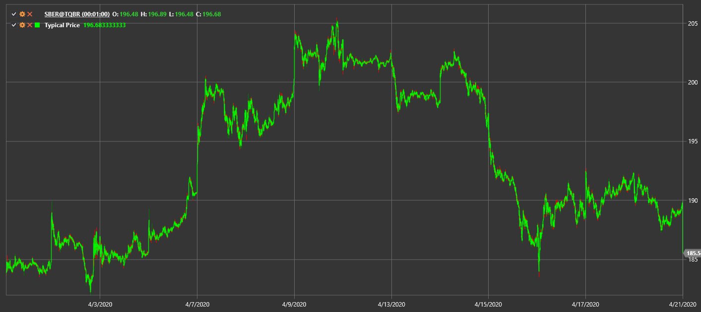

# Typical Price

**Типичная цена (Typical Price)** вычисляется как среднее значение High, Low и Close для свечи.

Для использования индикатора необходимо использовать класс [TypicalPrice](xref:StockSharp.Algo.Indicators.TypicalPrice).

## См. также

[Median Price](median_price.md)
