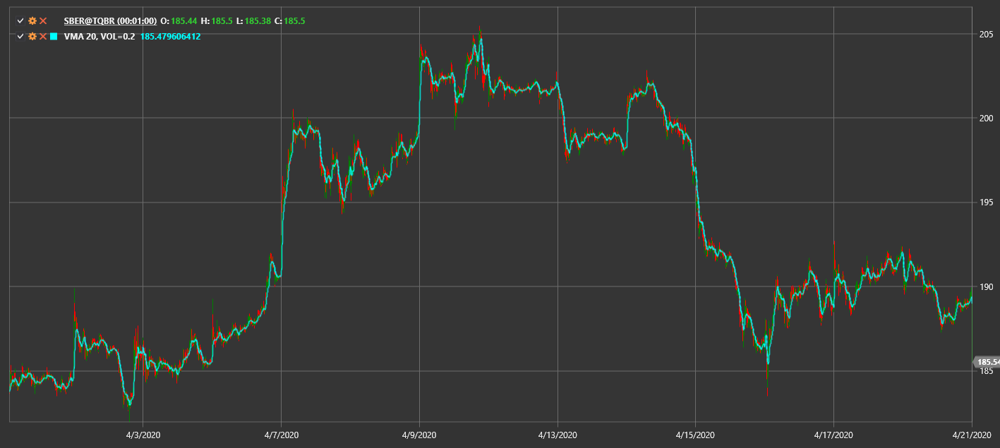

# Variable MA

**Variable Moving Average (VMA)** изменяет период сглаживания в зависимости от волатильности рынка.

Для использования индикатора необходимо использовать класс [VariableMovingAverage](xref:StockSharp.Algo.Indicators.VariableMovingAverage).

## См. также

[VIDYA](vidya.md)
