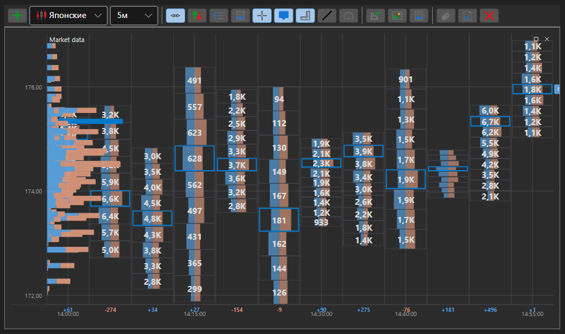

# Профиль объема (Volume Profile)

**Профиль Объёма (Volume Profile)** является передовым индикатором, который отображает торговую активность за определённый период времени и на определённых ценовых уровнях. Индикатор является гистограммой на графике, которая отражает преобладающие или важные ценовые уровни, основанные на объёме. 

Для использования индикатора необходимо использовать класс [VolumeProfileIndicator](xref:StockSharp.Algo.Indicators.VolumeProfileIndicator). 

## См. также

[Скользящая средняя, взвешенная по объему](volume_weighted_ma.md)
