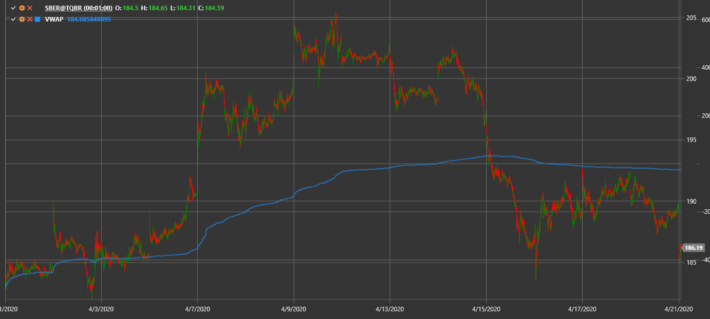

# VWAP

**Volume Weighted Average Price (VWAP)** показывает среднюю цену, взвешенную по объёму торгов.

Для использования индикатора необходимо использовать класс [VolumeWeightedAveragePrice](xref:StockSharp.Algo.Indicators.VolumeWeightedAveragePrice).

## См. также

[Time Weighted Average Price](time_weighted_average_price.md)
