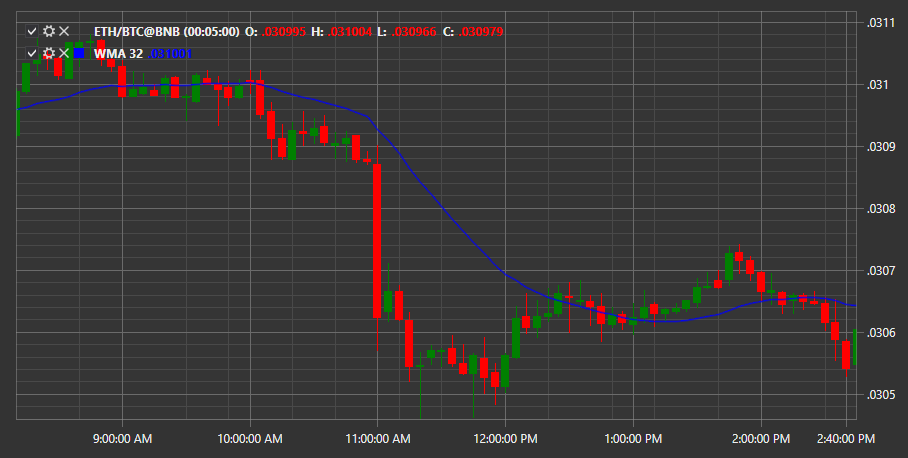

# Скользящая средняя, взвешенная по объему

**Взвешенная по объему скользящая средняя (VWMA)**\- индикатор отображает среднезвешенную по объему цену за определённый временной промежуток. Данный индикатор следует за ценой в виде извивающейся линии, имеет определённое отклонение относительно ценового графика.

Для использования индикатора необходимо использовать класс [VolumeWeightedMovingAverage](xref:StockSharp.Algo.Indicators.VolumeWeightedMovingAverage). 

## См. также

[взвешенная скользящая средняя](weighted_ma.md)
