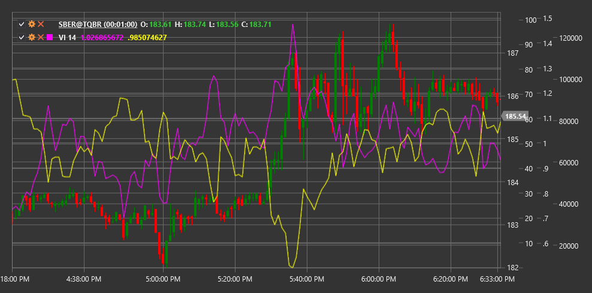

# VI

**Индикатор Vortex (Vortex Indicator, VI)** - это технический индикатор, разработанный Этьеном Буассе и Юлией Буассе в 2009 году. Индикатор состоит из двух линий, VI+ и VI-, которые показывают движение цены вверх и вниз соответственно, помогая идентифицировать начало новых трендов и подтверждать существующие.

Для использования индикатора необходимо использовать класс [VortexIndicator](xref:StockSharp.Algo.Indicators.VortexIndicator).

## Описание

Индикатор Vortex вдохновлен принципами вихревого движения в природе и призван отражать циклический характер рыночных движений. Он состоит из двух линий:

- **VI+** (положительный индикатор Vortex) - измеряет восходящее движение цены
- **VI-** (отрицательный индикатор Vortex) - измеряет нисходящее движение цены

Основные сигналы индикатора:
- Покупка, когда VI+ пересекает VI- снизу вверх
- Продажа, когда VI- пересекает VI+ снизу вверх
- Степень разделения между линиями указывает на силу тренда

Индикатор Vortex особенно полезен для:
- Определения начала новых трендов
- Оценки силы существующего тренда
- Идентификации потенциальных точек разворота

## Параметры

- **Length** - период расчета, обычно используется значение 14.

## Расчет

Расчет индикатора Vortex выполняется в несколько этапов:

1. Рассчитываются положительное и отрицательное движение:
   ```
   VM+ = |Current High - Previous Low|
   VM- = |Current Low - Previous High|
   ```

2. Рассчитывается True Range:
   ```
   TR = Max(High - Low, |High - Previous Close|, |Low - Previous Close|)
   ```

3. Суммируются значения VM+ и VM- за период Length:
   ```
   Sum_VM+ = Sum(VM+, Length)
   Sum_VM- = Sum(VM-, Length)
   ```

4. Суммируется True Range за период Length:
   ```
   Sum_TR = Sum(TR, Length)
   ```

5. Рассчитываются нормализованные значения VI+ и VI-:
   ```
   VI+ = Sum_VM+ / Sum_TR
   VI- = Sum_VM- / Sum_TR
   ```

Пересечение этих двух линий генерирует торговые сигналы: когда VI+ поднимается выше VI-, это сигнал бычьего тренда, и наоборот, когда VI- поднимается выше VI+, это сигнал медвежьего тренда.



## См. также

[ADX](adx.md)
[DMI](dmi.md)