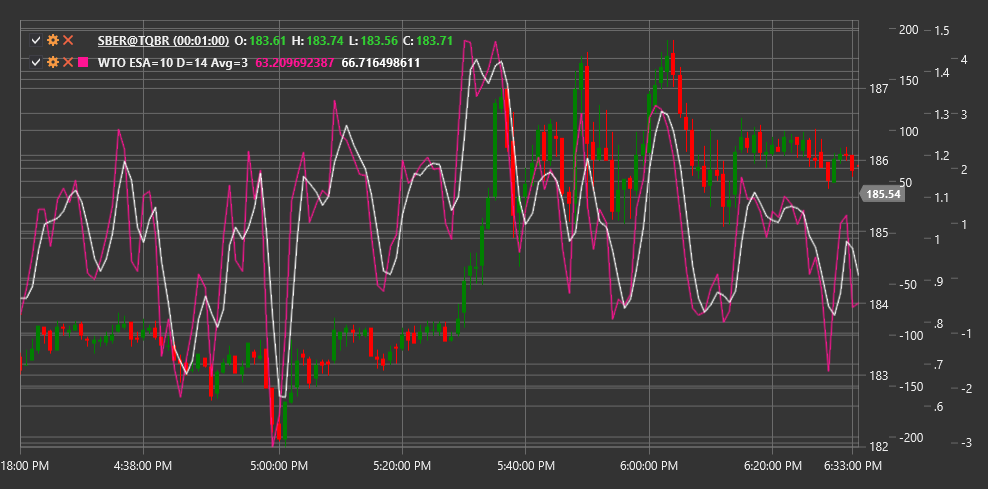

# WTO

**Осциллятор тренда волны (Wave Trend Oscillator, WTO)** - это технический индикатор, разработанный для определения перекупленных и перепроданных уровней рынка, а также для выявления циклических колебаний цены. WTO сочетает в себе элементы каналов и осцилляторов, что делает его эффективным инструментом для идентификации рыночных импульсов и потенциальных точек разворота.

Для использования индикатора необходимо использовать класс [WaveTrendOscillator](xref:StockSharp.Algo.Indicators.WaveTrendOscillator).

## Описание

Wave Trend Oscillator разработан для фильтрации рыночного шума и выделения основных ценовых движений. Индикатор колеблется вокруг нулевой линии, создавая волновые паттерны, которые коррелируют с циклическими ценовыми движениями.

Основные характеристики WTO:
- Колебания вокруг нулевой линии, где положительные значения указывают на восходящий тренд, а отрицательные - на нисходящий
- Уровни перекупленности (обычно выше +60) и перепроданности (обычно ниже -60)
- Способность фильтровать ценовой шум и выделять основные движения

Ключевые сигналы индикатора:
- Пересечение нулевой линии (смена направления тренда)
- Выход из зон перекупленности/перепроданности
- Дивергенции между WTO и ценой (потенциальные развороты)
- Специфические волновые паттерны

## Параметры

- **EsaPeriod** - период EMA для вычисления значения ESA (обычно 10)
- **DPeriod** - период для расчета отклонения (обычно 21)
- **AveragePeriod** - период для вычисления среднего значения заключительного осциллятора (обычно 4)

## Расчет

Расчет Wave Trend Oscillator включает в себя несколько этапов:

1. Вычисление среднетипичной цены:
   ```
   AP = (High + Low + Close) / 3
   ```

2. Создание сглаженного и абсолютного значения первого измерения:
   ```
   ESA = EMA(AP, EsaPeriod)
   D = EMA(Abs(AP - ESA), DPeriod)
   ```

3. Вычисление первой линии осциллятора:
   ```
   CI = (AP - ESA) / (0.015 * D)
   ```

4. Сглаживание осциллятора для получения окончательного значения WTO:
   ```
   WTO = EMA(CI, AveragePeriod)
   ```

Типичные значения для параметров индикатора: EsaPeriod = 10, DPeriod = 21, AveragePeriod = 4, но они могут быть адаптированы под различные временные рамки и инструменты.



## См. также

[MACD](macd.md)
[Стохастический осциллятор](stochastic_oscillator.md)