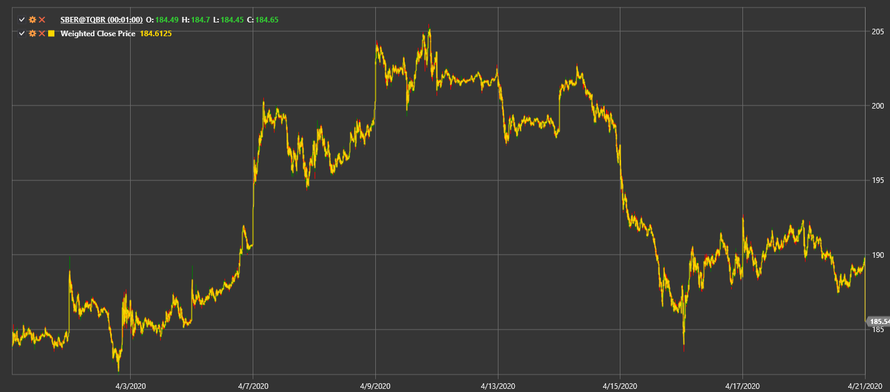

# Weighted Close Price

**Взвешенная цена закрытия (Weighted Close Price, WCP)** вычисляется как (High + Low + 2 × Close) / 4.

Для использования индикатора необходимо использовать класс [WeightedClosePrice](xref:StockSharp.Algo.Indicators.WeightedClosePrice).

## См. также

[Typical Price](typical_price.md)
