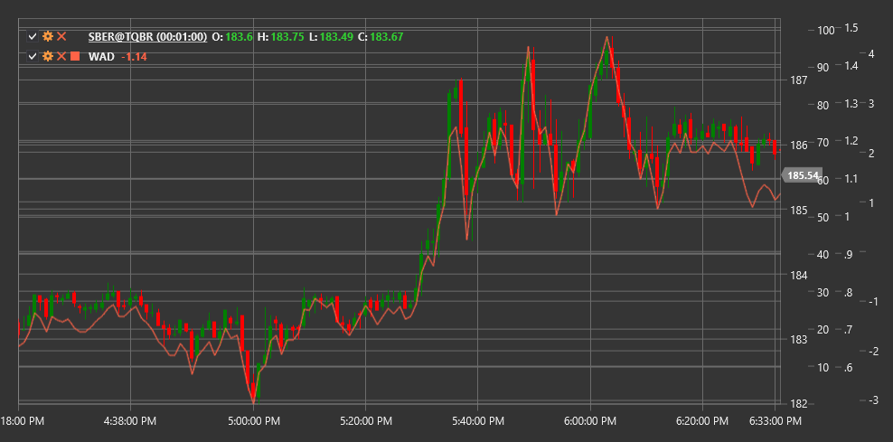

# WAD

**Накопление/распределение Вильямса (Williams Accumulation/Distribution, WAD)** - это индикатор объема, разработанный Ларри Вильямсом. В отличие от традиционной линии накопления/распределения, индикатор WAD фокусируется на взаимоотношении между ценой закрытия текущего периода и ценой закрытия предыдущего периода для определения давления покупателей или продавцов.

Для использования индикатора необходимо использовать класс [WilliamsAccumulationDistribution](xref:StockSharp.Algo.Indicators.WilliamsAccumulationDistribution).

## Описание

Индикатор накопления/распределения Вильямса разработан для определения расхождений между ценой и объемом, которые могут сигнализировать о потенциальных разворотах тренда. WAD особенно полезен для выявления слабости в текущем ценовом движении.

Ключевые особенности WAD:
- Положительные значения указывают на накопление (покупательское давление)
- Отрицательные значения указывают на распределение (давление продавцов)
- Дивергенции между WAD и ценой могут предшествовать ценовым разворотам

Основные применения индикатора:
- Подтверждение текущего тренда
- Выявление потенциальных ценовых разворотов
- Определение давления покупателей или продавцов

## Расчет

Расчет индикатора Williams Accumulation/Distribution осуществляется по следующей логике:

1. Определяем значение True Range Protection (TRP) для текущего периода:
   ```
   TRP = Max(High - Low, |High - Close_prev|, |Low - Close_prev|)
   ```

2. Рассчитываем значение Accumulation/Distribution (AD) для текущего периода:
   - Если Close > Close_prev (рынок вверх):
      ```
      AD = Close - Min(Low, Close_prev) 
      ```
   - Если Close < Close_prev (рынок вниз):
      ```
      AD = Close - Max(High, Close_prev)
      ```
   - Если Close = Close_prev:
      ```
      AD = 0
      ```

3. Вычисляем значение WAD, накапливая AD значения:
   ```
   WAD = Предыдущее значение WAD + AD
   ```

Индикатор накапливает положительные и отрицательные значения, образуя кумулятивную линию, которая может использоваться для сравнения с движением цены.



## См. также

[ADL](accumulation_distribution_line.md)
[OBV](on_balance_volume.md)