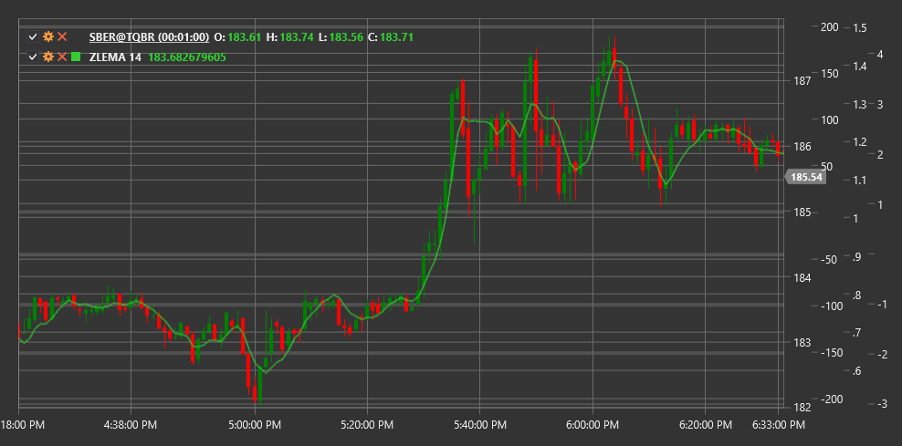

# ZLEMA

**Экспоненциальное скользящее среднее с нулевым запаздыванием (Zero Lag Exponential Moving Average, ZLEMA)** - это модифицированная версия экспоненциального скользящего среднего (EMA), разработанная Джоном Элерсом. ZLEMA предназначена для устранения или значительного уменьшения запаздывания, присущего традиционным скользящим средним.

Для использования индикатора необходимо использовать класс [ZeroLagExponentialMovingAverage](xref:StockSharp.Algo.Indicators.ZeroLagExponentialMovingAverage).

## Описание

Экспоненциальное скользящее среднее с нулевым запаздыванием (ZLEMA) было создано для решения основной проблемы большинства скользящих средних - запаздывания сигналов. Традиционные скользящие средние отстают от ценовых движений из-за временного окна, используемого для их расчета. ZLEMA минимизирует это запаздывание, используя механизм коррекции, который основан на разнице между текущей ценой и ценой в прошлом.

Основные преимущества ZLEMA:
- Более быстрая реакция на изменения цены
- Меньшее запаздывание по сравнению с традиционными скользящими средними
- Сохранение сглаживающего эффекта, характерного для EMA

ZLEMA может использоваться для:
- Определения направления тренда
- Поиска точек входа и выхода
- Идентификации уровней поддержки и сопротивления
- Создания торговых систем на основе пересечений

## Параметры

- **Length** - период расчета, определяющий степень сглаживания (аналогично периоду в EMA).

## Расчет

Расчет ZLEMA основан на устранении запаздывания с помощью прогнозирования и включает следующие шаги:

1. Расчет лага как половины периода:
   ```
   lag = (Length - 1) / 2
   ```

2. Вычисление "детрендированной" цены:
   ```
   detrendedPrice = 2 * Price - Price[lag]
   ```
   Это ключевой шаг, который позволяет "заглянуть вперед" и устранить запаздывание.

3. Применение экспоненциального сглаживания к детрендированной цене:
   ```
   k = 2 / (Length + 1)
   ZLEMA = k * detrendedPrice + (1 - k) * ZLEMA[previous]
   ```

Результатом является скользящее среднее, которое значительно ближе следует за ценой, чем обычное EMA с тем же периодом, но при этом сохраняет сглаживающий эффект.



## См. также

[EMA](ema.md)
[DEMA](dema.md)
[TEMA](tema.md)
[T3MA](t3_moving_average.md)