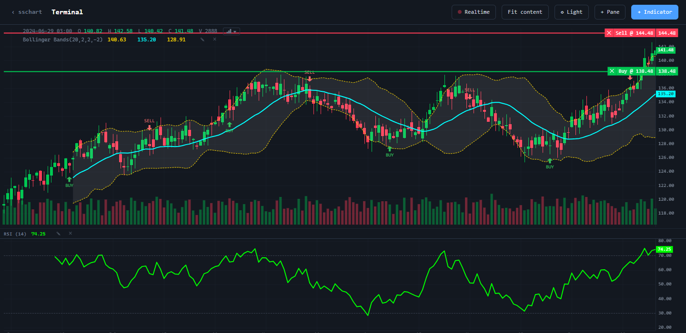

# Обвязка графика

`createChartUi` собирает вокруг движка готовый интерфейс: заголовки панелей, легенду с перекрестием, контекстное меню, меню типа графика и диалог индикаторов. Движок только рисует; всё, что вокруг него, живёт в отдельной точке входа `@stocksharp/chart/ui` — страница с одним спарклайном за неё не платит.



## Подключение

Слой поставляется отдельным подпутём пакета и требует свою таблицу стилей:

```ts
import { createChartUi, standaloneHost } from '@stocksharp/chart/ui';
import '@stocksharp/chart/ui.css';
```

Без сборщика подключите браузерный пакет `dist/sschartui.js` — он публикует глобальный объект `SSChartUI`. Загружать его нужно **после** `dist/sschart.js`: слой читает движок из опубликованного этим файлом глобального объекта, а не носит его вторую копию.

## Создание и обновление

Слою нужны элемент, в котором создан график, хост страницы, источник цены для контекстного меню и список типов графика для меню легенды:

```ts
import { createChart, CandlestickSeries } from '@stocksharp/chart';
import {
  ChartType,
  createChartUi,
  localChartUiStorage,
  standaloneHost,
  type ChartUi,
} from '@stocksharp/chart/ui';
import '@stocksharp/chart/ui.css';

declare const candles: { time: number; open: number; high: number; low: number; close: number; volume?: number }[];

const container = document.querySelector<HTMLElement>('#chart')!;

const chart = createChart(container, { timeScale: { timeVisible: true } });
const series = chart.addSeries(CandlestickSeries, { upColor: '#26a69a', downColor: '#ef5350' });
series.setData(candles);

const ui: ChartUi = createChartUi(chart, {
  container,
  host: standaloneHost,
  priceSource: series,
  chartTypes: [
    { value: ChartType.Candle, label: 'Candles', icon: 'bi bi-bar-chart-fill' },
    { value: ChartType.Line, label: 'Line', icon: 'bi bi-graph-up' },
  ],
  storage: localChartUiStorage('sschart'),
});

ui.setCandles(candles);
```

`setCandles` вызывается заново при каждой смене окна свечей — новый инструмент, переключённый тип графика, приехавшая страница истории. Один вызов обновляет и движок индикаторов, и легенду.

Опции `createChartUi`:

| Опция | Назначение |
|---|---|
| `container` | Элемент, в котором создан график; вокруг него строятся панели. |
| `host` | Перевод, форматирование и сообщения. |
| `priceSource` | Пиксель → цена для контекстного меню. |
| `chartTypes` | Пункты меню типа графика в порядке показа; пустой список меню не рисует. |
| `storage` | Где хранятся избранные индикаторы и шаблоны. По умолчанию — в памяти. |
| `dialogRoot` | Собственная разметка диалога индикаторов. Без неё разметка строится и добавляется в `body`. |
| `modal` | Своя реализация открытия и закрытия диалога. |
| `provideItems` | Строки страницы в контекстном меню — выше строк самого слоя. |

## Что возвращает createChartUi

Результат — это те же объекты, уже связанные между собой; дотянуться до любого из них можно напрямую.

| Поле | Что это |
|---|---|
| `engine` | `IndicatorEngine` — расчёт и жизненный цикл индикаторов. |
| `renderer` | `IndicatorRenderer` — серии, которыми рисуются выводы индикаторов. |
| `paneManager` | `ChartPaneManager` — заголовки панелей, их меню и восстановление. |
| `legend` | `ChartLegend` — строка OHLCV и значения индикаторов под перекрестием. |
| `dialog` | `IndicatorDialog` — каталог, поиск, параметры и активные индикаторы. |
| `menu` | `ChartContextMenu` — меню по правой кнопке. |
| `indicators` | `IndicatorController` — отменяемое редактирование уже добавленных индикаторов. |
| `templates` | `IndicatorTemplateController` — переносимые шаблоны настроек индикатора. |

## Публичные методы

- `setCandles(candles)` — передать текущее окно свечей движку индикаторов и легенде.
- `showIndicators()` — открыть диалог индикаторов.
- `dispose()` — снять меню, диалог, легенду и панели; созданная слоем разметка диалога удаляется.

## Хост страницы

Ни один модуль слоя не обращается к глобальным объектам: слова, числа и сообщения приходят из `ChartUiHost` — объекта с полями `translate`, `formatters` и `notify`.

```ts
import { consoleNotify, createTranslate, defaultChartFormatters, type ChartUiHost } from '@stocksharp/chart/ui';

const host: ChartUiHost = {
  translate: createTranslate({ 'Indicators': 'Индикаторы', 'Add indicator…': 'Добавить индикатор…' }),
  formatters: { ...defaultChartFormatters, price: value => value.toFixed(2) },
  notify: consoleNotify,
};
```

Словарь плоский и ключуется английским исходным текстом: неотвеченный ключ возвращает сам себя, то есть читаемую английскую строку, а не маркер отсутствующего перевода. Подстановка позиционная — `{0}`, `{1}`.

- `standaloneHost` — хост, отвечающий за всё сам: английский текст, форматирование по величине числа, сообщения в консоль.
- `identityTranslate` — перевод для страницы с одним языком; подстановка плейсхолдеров сохраняется.
- `defaultChartFormatters` — `price`, `volume` и `time` (Unix-секунды, формат `YYYY-MM-DD HH:MM`).
- `consoleNotify` — вывод сообщений в консоль браузера; уровни `success`, `info`, `warning`, `error`.
- `createPlainModalController(root)` — открытие и закрытие диалога для страницы без своей библиотеки модальных окон: подложка и закрытие по `Escape`. Клик мимо окна диалог не закрывает.

## Хранилище

Избранные индикаторы и шаблоны сохраняются через `ChartUiStorage` — две функции, `load(key)` и `save(key, value)`.

- `inMemoryChartUiStorage` — значение по умолчанию: данные живут столько же, сколько страница.
- `localChartUiStorage(prefix)` — обёртка над `localStorage` с префиксом, чтобы два графика на странице не перетирали избранное друг друга.

## Тип графика

`ChartTypeSwitcher` перерисовывает одно и то же окно баров свечами, барами, линией, областью, Heikin-Ashi, Renko или Point & Figure. Смена типа — это другой отрисовщик, поэтому серия создаётся заново, а прежний её экземпляр становится недействительным:

```ts
import {
  ChartType,
  ChartTypeSwitcher,
  allChartTypes,
  defaultChartTypePalette,
  parseChartType,
} from '@stocksharp/chart/ui';

const switcher = new ChartTypeSwitcher({
  chart,
  series,
  initialType: ChartType.Candle,
  availableTypes: allChartTypes,
  palette: defaultChartTypePalette,
  host: standaloneHost,
});
switcher.setRawCandles(candles);

switcher.onSeriesChanged(next => ui.menu.setPriceSource(next));

ui.legend.onChartTypeChange = value => {
  const type = parseChartType(value);
  if (type === null) return;

  switcher.switchType(type);
  ui.setCandles(switcher.getIndicatorCandles());
};
```

`parseChartType` читает тип из строки, которую страница хранила сама — сохранённой раскладки или атрибута кнопки, — и возвращает `null`, если такого типа нет. `getIndicatorCandles` отдаёт бары, по которым после переключения считаются индикаторы: Renko и Point & Figure перестраивают исходные бары в собственные, и `isDerivedChartType(type)` отвечает, произошло ли это — у таких баров нет и объёма. Остальные методы: `getCurrentSeries`, `getCurrentType`, `getAvailableTypes`, `updatePrice`.

## Контекстное меню

`ChartContextMenu` своих строк не добавляет — их даёт страница через `provideItems`, возвращая группы строк; между группами рисуется разделитель, пустые группы ничего не стоят. Строка описывается ключом `key`, текстом `label`, необязательными `icon`, `tone` и `disabled` и методом `invoke`. Тон задаётся значениями `ChartContextMenuTone`: `Neutral`, `Positive`, `Negative`.

```ts
import { ChartContextMenuTone, createChartUi, standaloneHost } from '@stocksharp/chart/ui';

const ui = createChartUi(chart, {
  container,
  host: standaloneHost,
  priceSource: series,
  chartTypes: [],
  provideItems: context => [[
    {
      key: 'buy',
      label: `Купить по ${context.priceText}`,
      icon: 'bi bi-arrow-up-circle',
      tone: ChartContextMenuTone.Positive,
      invoke: () => placeOrder('buy', context.price),
    },
  ]],
});
```

К этим строкам `createChartUi` добавляет свою группу — `Add indicator…` и `Add pane…`, обе через `host.translate`. `ChartContextMenuMode` различает меню на ценовом графике (`Chart`, есть цена под курсором) и на заголовке подпанели (`Pane`, цены нет). Методы: `init`, `setPriceSource`, `openAt`, `close`, `dispose`.

## Остальные экспорты

- `ChartLegend` и `fullscreenMenuLayer` — легенда и слой, в который открывается её плавающее меню (полноэкранный элемент, если он есть, иначе `body`). Методы легенды: `init`, `setRawCandles`, `setChartType`, `setIndicatorEngine`, `refresh`, `dispose`; обратные вызовы `onEditIndicator` и `onChartTypeChange`.
- `ChartPaneManager` — обвязка над встроенными панелями движка: `init`, `addPane`, `removePane`, `restorePane`, `getChart`, `getPanes`, `getPaneByMeasure`, `setPaneTitle`, `getValuesElement`, `legendLayer`, `resize`, `dispose`.
- `IndicatorDialog` и `createIndicatorCatalogController` — диалог индикаторов и модель его каталога. Методы диалога: `show`, `showForPane`, `showEdit`, `hide`, `dispose`.
- `IndicatorEngine`, `IndicatorRenderer`, `IndicatorSettings` — механика индикаторов, которой управляет диалог. Публикуется и отсюда, и из `@stocksharp/chart/indicators`.
- Типы `LegendBar`, `LegendChartType`, `LegendChart`, `LegendPaneHost`, `LegendIndicatorEngine`, `IndicatorPaneChart`, `IndicatorPaneHost`, `ChartContextMenuProvider`, `PriceCoordinateSource`, `ChartTypePalette`, `ModalController` — структурные контракты: страница, которая раскладывает панели или считает индикаторы сама, реализует их своими объектами.

## Смотрите также

- [JavaScript-графики](../charts.md)
- [Индикаторы](indicators.md)
- [Догрузка истории](backfill.md)
- [Свечи](candlestick.md)
