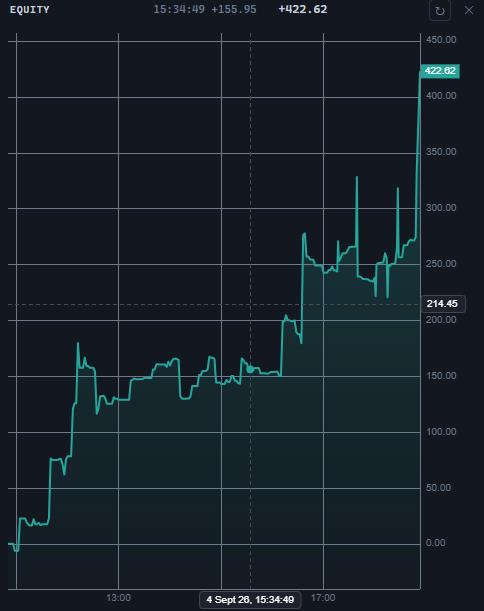

# Кривая эквити

`EquityWidget` рисует накопленный P&L прогона как график во времени. Панель зарегистрирована под идентификатором `equity` (`ControlTypes.Equity`), а сама кривая строится движком `@stocksharp/chart`, который подключается как peer-зависимость.



## Создание и обновление

```ts
import {
  EquityWidget,
  type PnlPoint,
  type TradingHost,
} from '@stocksharp/trading-controls';

declare const host: TradingHost;

const equity = EquityWidget.create(
  document.querySelector<HTMLElement>('#equity')!,
  {},
  { host },
);

const start = Date.now() - 3 * 60 * 60 * 1000;

const points: PnlPoint[] = [
  { time: start, value: 0 },
  { time: start + 45 * 60 * 1000, value: 320.5 },
  { time: start + 95 * 60 * 1000, value: -140.25 },
  { time: Date.now(), value: 1_180.75 },
];

equity.update(points);
```

Единственная зависимость `EquityDeps` — это `host`; обработчиков действий у панели нет, потому что на кривой нечего исполнять. Второй аргумент `create` — сохранённое состояние экземпляра — контролом не используется: собственных настроек панель не хранит ни в состоянии, ни в `host.preferences`.

`update` заменяет прогон целиком. Значение кривой накопительное, поэтому набор точек без ранее переданной выборки считается другим прогоном, а не продолжением прежнего.

## Данные и отрисовка

Поле `time` в `PnlPoint` — unix-миллисекунды; движок считает время в секундах, преобразование выполняет сам контрол. Точки сортируются по времени, выборки с нечисловыми `time` или `value` отбрасываются, а из нескольких значений в пределах одной секунды остаётся последнее — оно и показывает, где прогон действительно находился в этот момент.

Пока пригодных точек меньше двух, панель показывает сообщение по ключу `NoEquity`, график не создаётся, а `chart()` возвращает `null`. Сам график строится при первой отрисовке, а не в конструкторе: движку нужен уже размещённый на странице контейнер. За изменением размеров области следит `ResizeObserver`, который вызывает `resize` движка.

Цвета, шрифт и цвет сетки берутся из `host.presentation.canvasPalette()`. Кривая окрашивается по последнему значению прогона: `up` при значении не меньше нуля и `down` при отрицательном, заливка под линией — тот же цвет, приглушённый до 28 % сверху и 2 % снизу. Ось времени показывает часы и секунды в часовом поясе браузера, а при недоступности `Intl` — в UTC.

## Заголовок, подсказка и кнопки

В шапке панели выводится последнее значение прогона в формате `formatPnl` — со знаком и двумя знаками после запятой; класс цвета возвращает `host.presentation.pnlClass`. Над кривой показывается значение под указателем: момент словами `host.presentation.timeText`, рядом само значение. Когда указатель уходит с графика, подсказка очищается.

Кнопка в шапке с подсказкой `ResetView` вызывает `resetZoom`, кнопка закрытия — `host.close()`. Видимый текст панель получает по ключам `Equity`, `ResetView`, `ClosePanel`, `PnLChart` и `NoEquity`.

Контрол сам отвечает за форму кривой, её цвет и масштаб. Хосту остаются язык надписей, палитра, формат момента времени и источник самих точек: расчёт P&L контрол не ведёт и данные ниоткуда не запрашивает.

## Публичные методы

- `EquityWidget.create(hostEl, state, deps)` — создать панель и добавить её корневой элемент в контейнер.
- `EquityWidget.TYPE` — идентификатор `equity`.
- `update(points)` — показать прогон целиком.
- `resetZoom()` — вернуть обзор всего прогона после масштабирования.
- `chart()` — экземпляр `IChartApi`, чтобы хост дорисовал своё: линию эталона, отметку просадки. До появления графика возвращает `null`.
- `dispose()` — отключить наблюдатель размеров, удалить график и снять регистрацию в хосте.

Свойство `rootEl` даёт корневой элемент панели.

## Подключение движка графиков

Пакет `@stocksharp/chart` устанавливается отдельно:

```bash
npm install @stocksharp/chart
```

Готовый бандл `sstradingcontrols.js` движок в себя не включает, поэтому на странице без сборщика его скрипты подключаются рядом:

```html
<script src="https://cdn.jsdelivr.net/npm/@stocksharp/indicators/dist/ssindicators.js"></script>
<script src="https://cdn.jsdelivr.net/npm/@stocksharp/chart/dist/sschart.js"></script>
```

## Смотрите также

- [Торговые JavaScript-контролы](../trading_controls.md)
- [Позиции](positions.md)
- [История сделок](trade_history.md)
- [JavaScript-графики](../charts.md)
