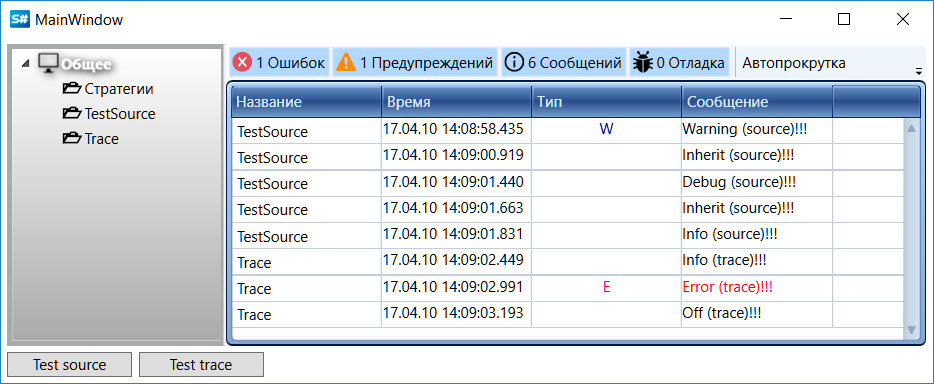

# Другие источники логов

В предыдущих топиках источниками логов выступали объекты встроенных в [S\#](../../api.md) классов. В [S\#](../../api.md) предусмотрены возможности для случаев, когда источником логов должен служить ваш собственный класс или же источник не должен быть связан с определенным классом, а обслуживать всё приложение. Для первого случая необходимо реализовать в вашем классе интерфейс [ILogSource](xref:Ecng.Logging.ILogSource) или наследовать его от [BaseLogReceiver](xref:Ecng.Logging.BaseLogReceiver). Во второй ситуации можно использовать источник [TraceSource](xref:Ecng.Logging.TraceSource), использующий систему трассировки .NET. Как это сделать показано в примере *Samples\/Misc\/SampleLogging*. 

## Пример SampleLogging

1. Создаем пользовательский класс, наследующий от [BaseLogReceiver](xref:Ecng.Logging.BaseLogReceiver).

   ```cs
   private class TestSource : BaseLogReceiver
   {
   }
   ```
2. Создаем [LogManager](xref:Ecng.Logging.LogManager) и декларируем переменную пользовательского класса.

   ```cs
   private readonly LogManager _logManager = new LogManager();
   private readonly TestSource _testSource;
   				
   ```
3. Добавляем источники логов.

   ```cs
   // пользовательский класс в качестве источника
   _logManager.Sources.Add(_testSource = new TestSource());
   // система трассировки .NET в качестве источника
   _logManager.Sources.Add(new Ecng.Logging.TraceSource());
   				
   ```
4. Добавляем "слушателей" логов.

   ```cs
   // выводим логи в окно Monitor
   _logManager.Listeners.Add(new GuiLogListener(Monitor));
   // выводим логи в файл
   _logManager.Listeners.Add(new FileLogListener
   {
   	FileName = "logs",
   });
   				
   ```
5. Добавляем сообщения логирования пользовательского класса. Уровень логирования выбирается случайным образом.

   ```cs
   var level = RandomGen.GetEnum<LogLevels>();
   switch (level)
   {
   	case LogLevels.Inherit:
   	case LogLevels.Debug:
   	case LogLevels.Info:
   	case LogLevels.Off:
   		_testSource.AddInfoLog("{0} (source)!!!".Put(level));
   		break;
   	case LogLevels.Warning:
   		_testSource.AddWarningLog("Warning (source)!!!");
   		break;
   	case LogLevels.Error:
   		_testSource.AddErrorLog("Error (source)!!!");
   		break;
   	default:
   		throw new ArgumentOutOfRangeException();
   }
   ```
6. Добавляем сообщения трассировки.

   ```cs
   var level = RandomGen.GetEnum<LogLevels>();
   switch (level)
   {
   	case LogLevels.Inherit:
   	case LogLevels.Debug:
   	case LogLevels.Info:
   	case LogLevels.Off:
   		Trace.TraceInformation("{0} (trace)!!!".Put(level));
   		break;
   	case LogLevels.Warning:
   		Trace.TraceWarning("Warning (trace)!!!");
   		break;
   	case LogLevels.Error:
   		Trace.TraceError("Error (trace)!!!");
   		break;
   	default:
   		throw new ArgumentOutOfRangeException();
   }
   ```
7. Результат работы примера.
