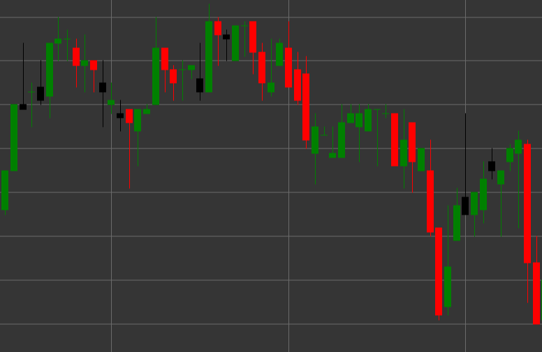

# Паттерн Bearish Candle (Медвежья свеча)

Bearish Candle (Медвежья свеча) - это свечной паттерн, характеризующийся тем, что цена закрытия ниже цены открытия. Этот паттерн показывает медвежье настроение рынка.

##### Ключевые особенности:

- Цена открытия выше цены закрытия (O > C).
- Указывает на медвежье давление на рынке.

### Интерпретация

Bearish Candle сигнализирует о медвежьем настроении рынка с некоторыми особенностями:

- Длинная верхняя тень указывает на то, что покупатели пытались поднять цену, но продавцы перехватили контроль.
- Закрытие ниже открытия показывает преобладание продавцов на момент завершения периода.
- Соотношение между телом свечи и верхней тенью демонстрирует силу продавцов после тестирования верхних уровней.
- В восходящем тренде может сигнализировать о потенциальном развороте или коррекции.
- В нисходящем тренде подтверждает силу тренда, особенно после отскока.

### Торговые стратегии

Bearish Candle может использоваться в различных торговых стратегиях:

- Вход в короткую позицию после формирования Bearish Candle на уровне сопротивления или в зоне перекупленности.
- Установка стоп-лосса выше максимума свечи для защиты от дальнейшего роста.
- Сочетание с другими техническими индикаторами или паттернами для повышения вероятности успешной сделки.
- Использование для подтверждения сигналов нисходящего тренда от индикаторов, таких как MACD или Moving Averages.
- Обращение внимания на объем торгов - высокий объем усиливает значимость сигнала.
- Возможность закрытия длинных позиций или частичного фиксирования прибыли при появлении этого паттерна в рамках восходящего тренда.

## См. также

[Pattern Bullish Candle](bullish.md)

[Pattern Black Candle](black_candle.md)
