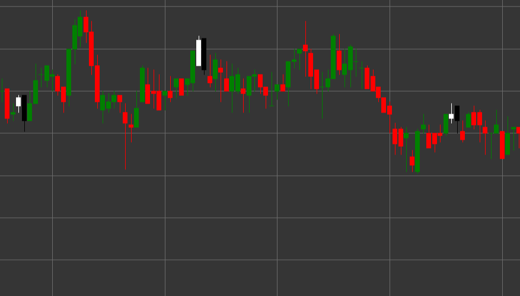

# Паттерн Bearish Engulfing (Медвежье поглощение)

Bearish Engulfing (Медвежье поглощение) - это мощный медвежий разворотный свечной паттерн, состоящий из двух свечей, который формируется в восходящем тренде. Первая свеча белая (бычья), за которой следует черная (медвежья) свеча, тело которой полностью поглощает (охватывает) тело предыдущей свечи.

##### Ключевые особенности:

- Первая свеча белая с ценой открытия ниже цены закрытия (O < C).
- Вторая свеча черная с ценой открытия выше цены закрытия (O > C).
- Цена открытия второй свечи выше цены закрытия первой свечи (O > pC).
- Цена закрытия второй свечи ниже цены открытия первой свечи (C < pO).
- Тело второй свечи полностью поглощает тело первой свечи.
- Формируется в восходящем тренде.

### Интерпретация

Bearish Engulfing считается одним из наиболее надежных сигналов разворота восходящего тренда:

- Первая свеча подтверждает существующий восходящий тренд и показывает контроль покупателей.
- Вторая свеча демонстрирует резкий переход контроля к продавцам, которые не только перекрывают прибыль предыдущего периода, но и создают значительное снижение.
- Полное поглощение предыдущего тела свечи символизирует полную смену преобладающего настроения с бычьего на медвежье.
- Чем больше размер второй свечи по сравнению с первой, тем сильнее сигнал.
- Если паттерн формируется на уровне сопротивления или после продолжительного восходящего тренда, его значимость возрастает.

### Торговые стратегии

Bearish Engulfing предоставляет отличные возможности для входа в короткую позицию:

- Вход в короткую позицию после формирования паттерна, обычно на открытии следующей свечи.
- Размещение стоп-лосса выше максимума второй свечи паттерна.
- Целевая прибыль может быть установлена на основе предыдущих уровней поддержки, соотношения риск/прибыль или с использованием технических индикаторов.
- Высокий объем торгов во время формирования второй свечи существенно повышает надежность сигнала.
- Комбинирование с другими индикаторами, такими как RSI в зоне перекупленности или дивергенция на осцилляторах, для повышения вероятности успешной сделки.
- Также может использоваться как сигнал для закрытия существующих длинных позиций.
