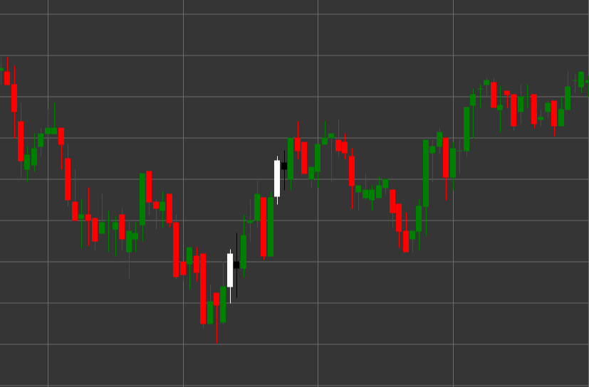

# Паттерн Bearish Harami (Медвежий харами)

Bearish Harami (Медвежий харами) - это свечной паттерн разворота, состоящий из двух свечей, который формируется в восходящем тренде. Термин "харами" происходит от японского слова, означающего "беременность", поскольку маленькая свеча (ребенок) содержится внутри большой свечи (матери).

##### Ключевые особенности:

- Первая свеча белая (бычья) с ценой открытия ниже цены закрытия (O < C) и длинным телом.
- Вторая свеча черная (медвежья) с ценой открытия выше цены закрытия (O > C) и меньшим телом.
- Тело второй свечи полностью содержится внутри тела первой свечи (O < pC) и (C > pO).
- Формируется в восходящем тренде.

### Интерпретация

Bearish Harami сигнализирует о потенциальном завершении восходящего тренда:

- Первая свеча подтверждает существующий восходящий тренд и силу покупателей.
- Вторая свеча, полностью содержащаяся внутри первой, указывает на потерю инерции бычьего движения и возможное появление продавцов.
- Чем меньше тело второй свечи по сравнению с первой, тем более выражена неопределенность и потенциал для разворота.
- Если вторая свеча является дожи (с очень маленьким телом), паттерн называется "Харами Кросс" и считается более сильным сигналом неопределенности.
- Этот паттерн часто рассматривается как более слабый сигнал по сравнению с Bearish Engulfing, но может быть более ранним индикатором возможного разворота.

### Торговые стратегии

Bearish Harami обычно требует дополнительного подтверждения для входа в позицию:

- Ожидание подтверждающей медвежьей свечи после формирования паттерна перед входом в короткую позицию.
- Размещение стоп-лосса выше максимума паттерна или максимума первой свечи.
- Использование объема торгов как дополнительного подтверждения - снижение объема на второй свече и увеличение на последующих медвежьих свечах усиливает сигнал.
- Комбинирование с другими техническими индикаторами, такими как RSI в зоне перекупленности или дивергенция осцилляторов.
- Рассмотрение паттерна на уровнях сопротивления или в зонах перекупленности для повышения вероятности успешной сделки.
- Возможное использование для закрытия существующих длинных позиций, даже если сигнал недостаточно силен для открытия коротких позиций.

## См. также

[Pattern Bullish Harami](bullish_harami.md)

[Pattern Bearish Engulfing](bearish_engulfing.md)
