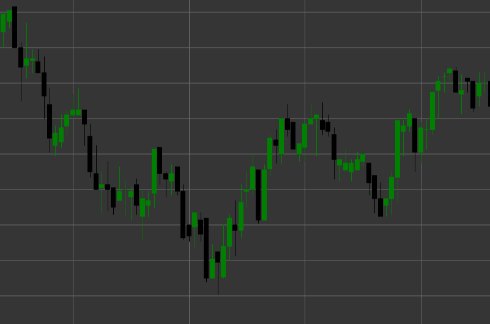

# Паттерн Black Candle (Черная свеча)

Черная свеча (медвежья свеча) - это классический свечной паттерн, который образуется, когда цена закрытия ниже цены открытия. Эта свеча отражает медвежье настроение рынка, где продавцы контролировали цену в течение периода формирования свечи.

##### Ключевые особенности:

- Цена открытия выше цены закрытия (O > C).
- Тело свечи обычно закрашено черным (или красным в современных графиках).
- Указывает на преобладание продавцов над покупателями.
- Размер тела свечи показывает силу медвежьего движения.

### Интерпретация

Черная свеча сигнализирует о медвежьем давлении на рынке:

- Чем длиннее тело свечи, тем сильнее медвежье давление.
- Длинная черная свеча после восходящего тренда может указывать на потенциальный разворот.
- Наличие коротких теней свидетельствует о том, что медведи контролировали цену на протяжении всего периода.
- Последовательные черные свечи указывают на устойчивый нисходящий тренд.

### Торговые стратегии

Хотя одиночная черная свеча обычно не является самостоятельным торговым сигналом, она может использоваться в рамках более широкой стратегии:

- Подтверждение нисходящего тренда или разворота после восходящего движения.
- Поиск длинных черных свечей на уровнях сопротивления для потенциальных коротких позиций.
- Использование в комбинации с другими свечными паттернами, например, черная свеча после медвежьего поглощения.
- Определение уровней поддержки после серии последовательных черных свечей.

## См. также

[Pattern White Candle](white_candle.md)

[Pattern Black Marubozu](black_marubozu.md)
