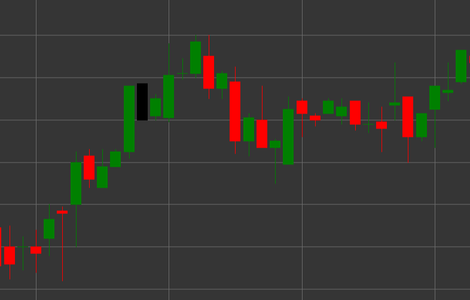

# Паттерн Black Marubozu (Черный Марубозу)

Black Marubozu (Черный Марубозу) - это медвежий свечной паттерн, который характеризуется отсутствием теней на обоих концах свечи. Термин "марубозу" происходит от японского слова, означающего "бритоголовый" или "стриженный", что отражает внешний вид свечи без теней.

##### Ключевые особенности:

- Цена открытия выше цены закрытия (O > C).
- Тело свечи полностью заполнено, без верхней и нижней тени.
- Цена открытия равна максимуму свечи, а цена закрытия равна минимуму свечи.
- Представляет собой сильное медвежье движение, где продавцы контролировали цену на протяжении всего периода.

### Интерпретация

Black Marubozu считается сильным медвежьим сигналом:

- Отсутствие теней указывает на полную доминацию продавцов - цена открылась на максимуме и непрерывно падала до закрытия периода.
- Длинный Black Marubozu свидетельствует об очень сильном медвежьем давлении.
- Появление этого паттерна после восходящего тренда может сигнализировать о развороте.
- В рамках нисходящего тренда подтверждает силу движения.

### Торговые стратегии

Black Marubozu предоставляет более сильный сигнал, чем обычная черная свеча:

- Возможность входа в короткую позицию после формирования Black Marubozu, особенно если он появляется на важном уровне сопротивления.
- Использование цены закрытия Black Marubozu как уровня сопротивления при установке стоп-лоссов.
- Сочетание с другими техническими индикаторами для подтверждения сигнала.
- Обращение внимания на объем торгов - высокий объем усиливает значимость сигнала.

## См. также

[Pattern White Marubozu](white_marubozu.md)

[Pattern Black Candle](black_candle.md)
