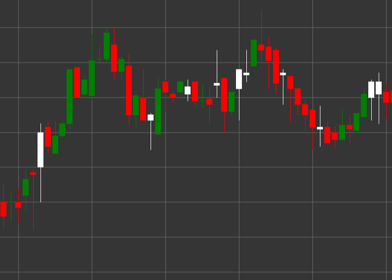

# Паттерн Bullish Candle (Бычья свеча)

Bullish Candle (Бычья свеча) - это свечной паттерн, характеризующийся тем, что цена закрытия выше цены открытия. Этот паттерн показывает бычье настроение рынка.

##### Ключевые особенности:

- Цена открытия ниже цены закрытия (O < C).
- Указывает на бычье давление на рынке.

### Интерпретация

Bullish Candle сигнализирует о бычьем настроении рынка с некоторыми особенностями:

- Длинная нижняя тень указывает на то, что продавцы пытались снизить цену, но покупатели перехватили контроль.
- Закрытие выше открытия показывает преобладание покупателей на момент завершения периода.
- Соотношение между телом свечи и нижней тенью демонстрирует силу покупателей после тестирования нижних уровней.
- В нисходящем тренде может сигнализировать о потенциальном развороте.
- В восходящем тренде подтверждает силу тренда, особенно после коррекции.

### Торговые стратегии

Bullish Candle может использоваться в различных торговых стратегиях:

- Вход в длинную позицию после формирования Bullish Candle на уровне поддержки или в зоне перепроданности.
- Установка стоп-лосса ниже минимума свечи для защиты от дальнейшего снижения.
- Сочетание с другими техническими индикаторами или паттернами для повышения вероятности успешной сделки.
- Использование для подтверждения сигналов восходящего тренда от индикаторов, таких как MACD или Moving Averages.
- Обращение внимания на объем торгов - высокий объем усиливает значимость сигнала.

## См. также

[Pattern Bearish Candle](bearish.md)

[Pattern White Candle](white_candle.md)
