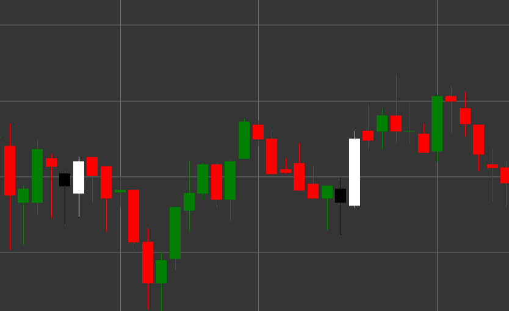

# Паттерн Bullish Engulfing (Бычье поглощение)

Bullish Engulfing (Бычье поглощение) - это мощный бычий разворотный свечной паттерн, состоящий из двух свечей, который формируется в нисходящем тренде. Первая свеча черная (медвежья), за которой следует белая (бычья) свеча, тело которой полностью поглощает (охватывает) тело предыдущей свечи.

##### Ключевые особенности:

- Первая свеча черная с ценой открытия выше цены закрытия (O > C).
- Вторая свеча белая с ценой открытия ниже цены закрытия (O < C).
- Цена открытия второй свечи ниже цены закрытия первой свечи (O < pC).
- Цена закрытия второй свечи выше цены открытия первой свечи (C > pO).
- Тело второй свечи полностью поглощает тело первой свечи.
- Формируется в нисходящем тренде.

### Интерпретация

Bullish Engulfing считается одним из наиболее надежных сигналов разворота нисходящего тренда:

- Первая свеча подтверждает существующий нисходящий тренд и показывает контроль продавцов.
- Вторая свеча демонстрирует резкий переход контроля к покупателям, которые не только перекрывают потери предыдущего периода, но и создают значительный прирост.
- Полное поглощение предыдущего тела свечи символизирует полную смену преобладающего настроения с медвежьего на бычье.
- Чем больше размер второй свечи по сравнению с первой, тем сильнее сигнал.
- Если паттерн формируется на уровне поддержки или после продолжительного нисходящего тренда, его значимость возрастает.

### Торговые стратегии

Bullish Engulfing предоставляет отличные возможности для входа в длинную позицию:

- Вход в длинную позицию после формирования паттерна, обычно на открытии следующей свечи.
- Размещение стоп-лосса ниже минимума второй свечи паттерна.
- Целевая прибыль может быть установлена на основе предыдущих уровней сопротивления, соотношения риск/прибыль или с использованием технических индикаторов.
- Высокий объем торгов во время формирования второй свечи существенно повышает надежность сигнала.
- Комбинирование с другими индикаторами, такими как RSI в зоне перепроданности или схождение скользящих средних, для повышения вероятности успешной сделки.

## См. также

[Pattern Bearish Engulfing](bearish_engulfing.md)

[Pattern Piercing](piercing.md)
