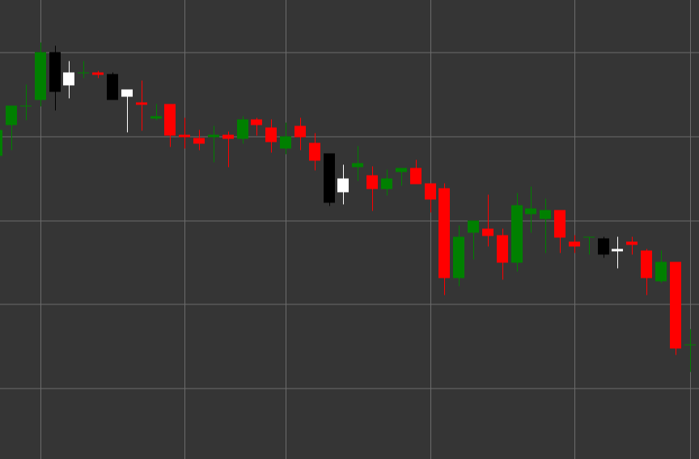

# Паттерн Bullish Harami (Бычий харами)

Bullish Harami (Бычий харами) - это свечной паттерн разворота, состоящий из двух свечей, который формируется в нисходящем тренде. Термин "харами" происходит от японского слова, означающего "беременность", поскольку маленькая свеча (ребенок) содержится внутри большой свечи (матери).

##### Ключевые особенности:

- Первая свеча черная (медвежья) с ценой открытия выше цены закрытия (O > C) и длинным телом.
- Вторая свеча белая (бычья) с ценой открытия ниже цены закрытия (O < C) и меньшим телом.
- Тело второй свечи полностью содержится внутри тела первой свечи (O > pC) и (C < pO).
- Формируется в нисходящем тренде.

### Интерпретация

Bullish Harami сигнализирует о потенциальном завершении нисходящего тренда:

- Первая свеча подтверждает существующий нисходящий тренд и силу продавцов.
- Вторая свеча, полностью содержащаяся внутри первой, указывает на потерю инерции медвежьего движения и возможное появление покупателей.
- Чем меньше тело второй свечи по сравнению с первой, тем более выражена неопределенность и потенциал для разворота.
- Если вторая свеча является дожи (с очень маленьким телом), паттерн называется "Харами Кросс" и считается более сильным сигналом неопределенности.
- Этот паттерн часто рассматривается как более слабый сигнал по сравнению с Bullish Engulfing, но может быть более ранним индикатором возможного разворота.

### Торговые стратегии

Bullish Harami обычно требует дополнительного подтверждения для входа в позицию:

- Ожидание подтверждающей бычьей свечи после формирования паттерна перед входом в длинную позицию.
- Размещение стоп-лосса ниже минимума паттерна или минимума первой свечи.
- Использование объема торгов как дополнительного подтверждения - снижение объема на второй свече и увеличение на последующих бычьих свечах усиливает сигнал.
- Комбинирование с другими техническими индикаторами, такими как RSI в зоне перепроданности или дивергенция осцилляторов.
- Рассмотрение паттерна на уровнях поддержки или в зонах перепроданности для повышения вероятности успешной сделки.
- Возможное использование для закрытия существующих коротких позиций, даже если сигнал недостаточно силен для открытия длинных позиций.

## См. также

[Pattern Bearish Harami](bearish_harami.md)

[Pattern Bullish Engulfing](bullish_engulfing.md)
