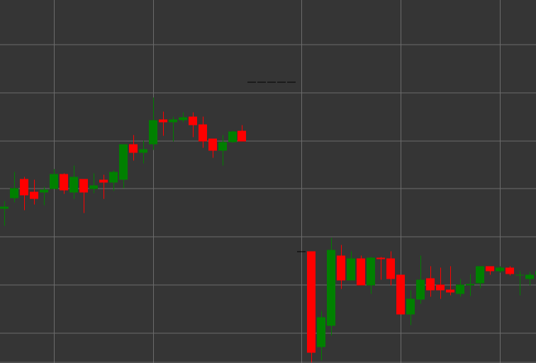

# Паттерн Dragonfly (Стрекоза)

Dragonfly (Стрекоза) - это свечной паттерн, который характеризуется равенством цены открытия и закрытия, отсутствием верхней тени и длинной нижней тенью. Свеча напоминает форму буквы "T", что и дало ей название "стрекоза".

##### Ключевые особенности:

- Цена открытия равна цене закрытия (O == C).
- Отсутствует верхняя тень (TS == 0).
- Длинная нижняя тень.
- Похож на Hammer, но с нейтральным телом (doji).

### Интерпретация

Dragonfly Doji считается потенциальным сигналом разворота, особенно в нисходящем тренде:

- Длинная нижняя тень указывает на то, что продавцы контролировали рынок в течение большей части периода, но затем покупатели вернули цену к уровню открытия.
- Отвержение более низких цен может сигнализировать о завершении медвежьего давления.
- В отличие от обычного Hammer, равенство цен открытия и закрытия (doji) указывает на более выраженное равновесие сил.
- В нисходящем тренде этот паттерн имеет бычье значение и может предвещать разворот.
- В восходящем тренде может сигнализировать о потенциальной коррекции.

### Торговые стратегии

Dragonfly требует дополнительного подтверждения для принятия торговых решений:

- Ожидание подтверждающей бычьей свечи на следующий период перед входом в длинную позицию.
- Размещение стоп-лосса ниже минимума Dragonfly.
- Использование в сочетании с уровнями поддержки или перепроданными условиями на индикаторах.
- Обращение внимания на объем - высокий объем во время формирования Dragonfly повышает достоверность сигнала.
- Возможное использование для определения точки выхода из коротких позиций, даже без входа в длинную позицию.

## См. также

[Pattern Gravestone](gravestone.md)

[Pattern Hammer](hammer.md)
