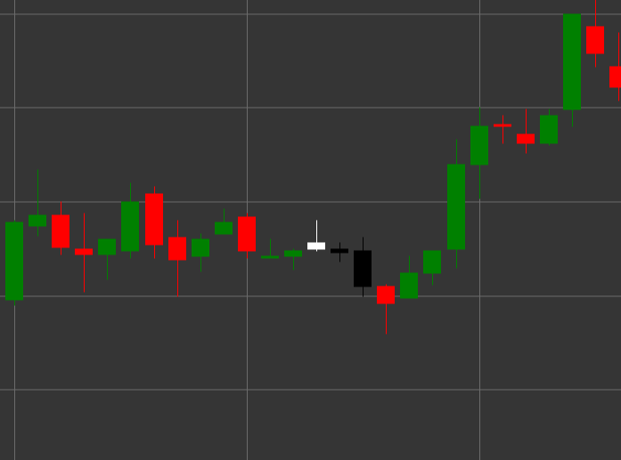

# Паттерн Evening Star (Вечерняя звезда)

Evening Star (Вечерняя звезда) - это медвежий разворотный свечной паттерн, состоящий из трех свечей, который формируется в восходящем тренде. Этот паттерн показывает переход от бычьего настроения к медвежьему через период неопределенности или консолидации.

##### Ключевые особенности:

- Первая свеча белая (бычья) с ценой открытия ниже цены закрытия (O < C).
- Вторая свеча имеет маленькое тело (может быть как бычьей, так и медвежьей) и образует ценовой разрыв (гэп) вверх от первой свечи. Тело свечи значительно меньше тела первой свечи (B < pB * 0.5m).
- Третья свеча черная (медвежья) с ценой открытия выше цены закрытия и большим телом ((O > C) && (B > pB * 2)), которая закрывается глубоко внутри тела первой свечи.
- Формируется в восходящем тренде.

### Интерпретация

Evening Star считается сильным сигналом потенциального разворота восходящего тренда:

- Первая свеча подтверждает силу бычьего тренда.
- Вторая свеча (звезда) показывает ослабление бычьего давления и неопределенность на рынке.
- Третья свеча демонстрирует возвращение продавцов и смену контроля с быков на медведей.
- Чем глубже третья свеча проникает в тело первой свечи, тем сильнее сигнал разворота.
- Если вторая свеча является дожи (с очень маленьким телом), паттерн называется "Вечерняя звезда дожи" и считается еще более сильным сигналом.

### Торговые стратегии

Evening Star предоставляет хорошие возможности для входа в короткую позицию:

- Вход в короткую позицию после формирования паттерна, обычно на открытии четвертой свечи или при пробое минимума третьей свечи.
- Размещение стоп-лосса выше максимума второй свечи или максимума всего паттерна.
- Целевая прибыль может быть установлена на основе фибоначчи-уровней относительно предыдущего восходящего движения или предыдущих уровней поддержки.
- Обращение внимания на объем - увеличение объема на третьей свече подтверждает силу медвежьего разворота.
- Комбинирование с другими техническими индикаторами, такими как RSI в зоне перекупленности или линии сопротивления, для повышения надежности сигнала.
- Также может использоваться как сигнал для выхода из существующих длинных позиций.

## См. также

[Pattern Morning Star](morning_star.md)

[Pattern Three Black Crows](three_black_crows.md)