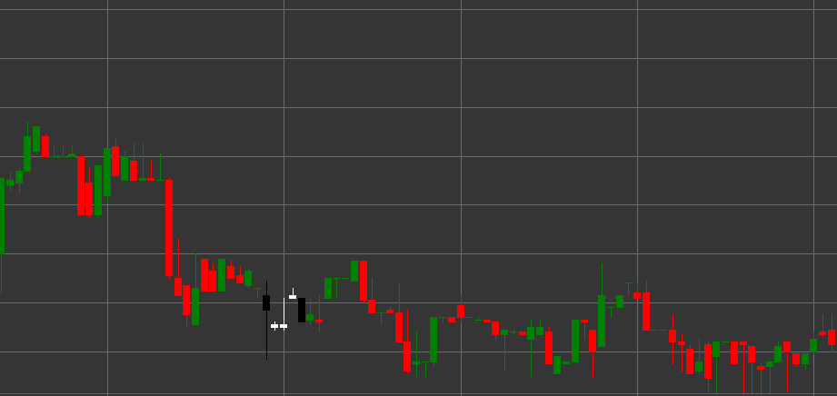

# Паттерн Falling Three Methods (Падающие три метода)

Falling Three Methods (Падающие три метода) - это медвежий паттерн продолжения тренда, состоящий из пяти свечей, который формируется в нисходящем тренде. Этот паттерн показывает временную консолидацию или отдых в рамках существующего нисходящего тренда перед его продолжением.

##### Ключевые особенности:

- Первая свеча черная (медвежья) с ценой открытия выше цены закрытия (O > C) и длинным телом.
- Следующие три свечи белые (бычьи) с ценой открытия ниже цены закрытия (O < C), с небольшими телами (B * 3 < pB), (B == pB), (B == pB).
- Тела трех средних свечей не выходят за пределы диапазона первой свечи.
- Пятая свеча черная (медвежья) с ценой открытия выше цены закрытия (O > C) и длинным телом (B > pB * 3).
- Пятая свеча пробивает минимум первой свечи и закрывается ниже.
- Формируется в нисходящем тренде.

### Интерпретация

Falling Three Methods считается надежным сигналом продолжения нисходящего тренда:

- Первая длинная черная свеча показывает силу нисходящего тренда.
- Три небольшие белые свечи представляют собой временную консолидацию или коррекцию, во время которой покупатели не смогли существенно изменить тренд.
- Пятая длинная черная свеча подтверждает возвращение контроля к продавцам и продолжение нисходящего тренда.
- Этот паттерн можно рассматривать как флаг или вымпел в классическом техническом анализе.
- Такая последовательность свечей указывает на то, что коррекция была использована для накопления коротких позиций перед продолжением движения вниз.

### Торговые стратегии

Falling Three Methods предоставляет хорошие возможности для входа или усиления коротких позиций:

- Вход в короткую позицию на открытии после пятой свечи или при пробое минимума первой свечи.
- Размещение стоп-лосса выше максимума коррекционных свечей или выше максимума первой свечи.
- Целевая прибыль может быть установлена с использованием проекции, равной расстоянию от начала тренда до первой свечи паттерна.
- Обращение внимания на объем - идеально, когда объем снижается на трех средних свечах и значительно увеличивается на пятой свече.
- Комбинирование с другими техническими индикаторами для подтверждения сигнала.
- Учет важных уровней поддержки ниже текущей цены, которые могут повлиять на развитие движения.

## См. также

[Pattern Rising Three Methods](rising_three_methods.md)

[Pattern Three Black Crows](three_black_crows.md)
