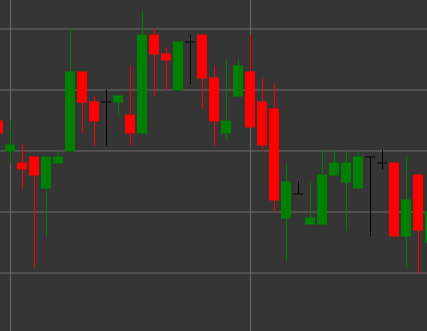

# Паттерн Flat (Neutral) Candle (Флэт свеча)

Флэт (нейтральная) свеча - это свечной паттерн, который образуется, когда цена открытия и закрытия идентичны или очень близки. Эта свеча отражает нерешительность рынка, когда силы покупателей и продавцов уравновешены.

##### Ключевые особенности:

- Цена открытия равна цене закрытия (O == C).
- Верхняя и нижняя тени могут быть разной длины.
- Указывает на нейтральность или нерешительность рынка.
- Может сигнализировать о консолидации перед продолжением существующего тренда или возможным разворотом.

### Интерпретация

Флэт свеча сама по себе не дает четкого сигнала о направлении рынка, но может быть полезной в контексте предыдущих свечей и общего тренда:

- После сильного движения вверх или вниз флэт свеча может сигнализировать об ослаблении импульса и возможном развороте.
- Во время бокового движения флэт свеча подтверждает продолжение консолидации.
- Размер теней может дать дополнительную информацию о настроении рынка - длинные тени указывают на отклоненные попытки движения цены, в то время как короткие тени свидетельствуют о низкой волатильности.

### Торговые стратегии

Флэт свечи редко используются как самостоятельные сигналы для входа в позицию, но могут помочь в принятии торговых решений:

- Поиск подтверждения от последующих свечей или других технических индикаторов перед совершением сделки.
- Использование флэт свечей для определения уровней поддержки или сопротивления в комбинации с другими методами анализа.
- Увеличение размера стоп-лосса или фиксация прибыли, если в тренде появляются флэт свечи, что может указывать на ослабление движения.

## См. также

[Pattern White Candle](white_candle.md)

[Pattern Black Candle](black_candle.md)
