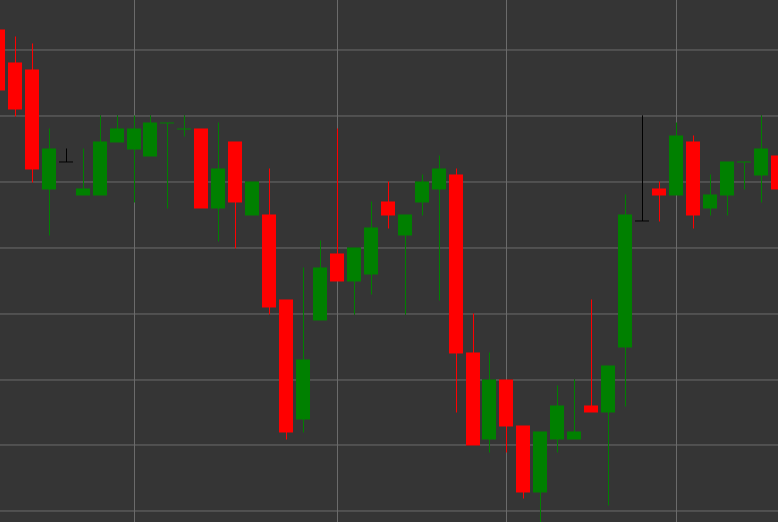

# Паттерн Gravestone (Надгробие)

Gravestone (Надгробие) - это свечной паттерн, который характеризуется равенством цены открытия и закрытия, длинной верхней тенью и отсутствием нижней тени. Свеча напоминает форму перевернутой буквы "T", что и дало ей название "надгробие".

##### Ключевые особенности:

- Цена открытия равна цене закрытия (O == C).
- Длинная верхняя тень.
- Отсутствует нижняя тень (BS == 0).
- Похож на Shooting Star, но с нейтральным телом (doji).

### Интерпретация

Gravestone Doji считается потенциальным сигналом разворота, особенно в восходящем тренде:

- Длинная верхняя тень указывает на то, что покупатели контролировали рынок в течение большей части периода, но затем продавцы вернули цену к уровню открытия.
- Отвержение более высоких цен может сигнализировать о завершении бычьего импульса.
- В отличие от обычного Shooting Star, равенство цен открытия и закрытия (doji) указывает на более выраженное равновесие сил.
- В восходящем тренде этот паттерн имеет медвежье значение и может предвещать разворот.
- В нисходящем тренде может указывать на временное сопротивление или продолжение тренда.

### Торговые стратегии

Gravestone требует дополнительного подтверждения для принятия торговых решений:

- Ожидание подтверждающей медвежьей свечи на следующий период перед входом в короткую позицию.
- Размещение стоп-лосса выше максимума Gravestone.
- Использование в сочетании с уровнями сопротивления или перекупленными условиями на индикаторах.
- Обращение внимания на объем - высокий объем во время формирования Gravestone повышает достоверность сигнала.
- Возможное использование для определения точки выхода из длинных позиций, даже без входа в короткую позицию.

## См. также

[Pattern Dragonfly](dragonfly.md)

[Pattern Shooting Star](shooting_star.md)