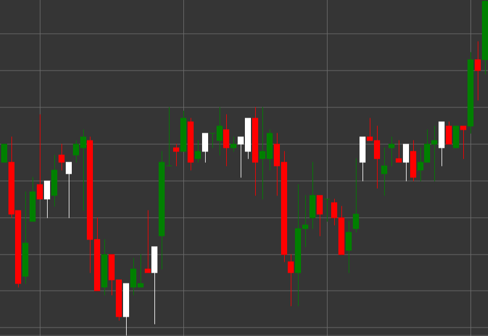

# Паттерн Hammer (Молот)

Hammer (Молот) - это бычий свечной паттерн, который формируется во время нисходящего тренда. Свеча имеет маленькое тело в верхней части и длинную нижнюю тень, при этом верхняя тень отсутствует или очень короткая. Название происходит от сходства формы свечи с молотком.

##### Ключевые особенности:

- Цена открытия ниже цены закрытия (O < C), хотя может быть и наоборот.
- Маленькое тело свечи в верхней части диапазона цен.
- Длинная нижняя тень, которая обычно в 2-3 раза длиннее тела.
- Отсутствие или очень короткая верхняя тень.
- Формируется в нисходящем тренде.

### Интерпретация

Hammer считается сильным сигналом потенциального разворота нисходящего тренда:

- Длинная нижняя тень показывает, что цена значительно упала в течение периода, но затем покупатели вмешались и подняли цену обратно.
- Это указывает на отвержение рынком более низких цен и потенциальную смену настроения с медвежьего на бычье.
- Чем длиннее нижняя тень, тем сильнее потенциальный разворотный сигнал.
- Цвет тела свечи имеет меньшее значение, хотя белый/зеленый молот считается более бычьим, чем черный/красный.

### Торговые стратегии

Hammer предоставляет возможности для входа в длинную позицию:

- Ожидание подтверждения от следующей свечи - бычья свеча после Hammer усиливает сигнал разворота.
- Размещение уровня стоп-лосса ниже минимума Hammer.
- Установка целевой прибыли на основе предыдущих уровней сопротивления или соотношения риск/прибыль.
- Комбинирование с другими техническими индикаторами, такими как RSI или MACD, для подтверждения разворота тренда.
- Более высокий объем торгов во время формирования Hammer повышает надежность сигнала.

## См. также

[Pattern Inverted Hammer](inverted_hammer.md)

[Pattern Hanging Man](hanging_man.md)
