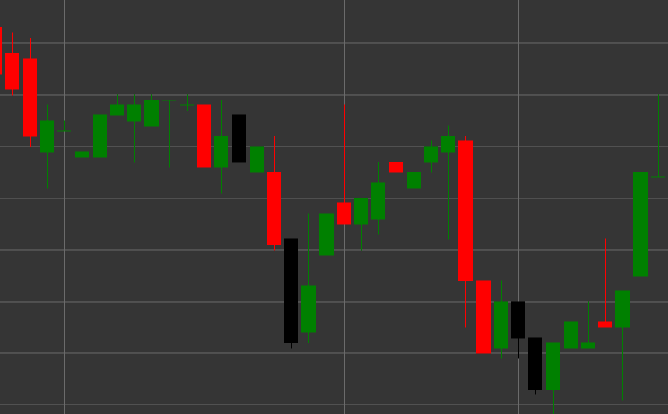

# Паттерн Hanging Man (Повешенный)

Hanging Man (Повешенный) - это медвежий разворотный свечной паттерн, который формируется в восходящем тренде. Свеча имеет маленькое тело в верхней части и длинную нижнюю тень, при этом верхняя тень отсутствует или очень короткая. Форма свечи напоминает фигуру человека с висящими ногами, отсюда и название.

##### Ключевые особенности:

- Цена открытия выше цены закрытия (O > C), хотя может быть и наоборот.
- Маленькое тело свечи в верхней части диапазона цен.
- Длинная нижняя тень, которая обычно в 2-3 раза длиннее тела.
- Отсутствие или очень короткая верхняя тень (TS == 0).
- Формируется в восходящем тренде.

### Интерпретация

Hanging Man считается предупреждением о потенциальном завершении восходящего тренда:

- Длинная нижняя тень показывает, что цена значительно упала во время торговой сессии, что указывает на появление продавцов.
- Несмотря на то, что покупатели смогли вернуть цену к верхней части диапазона, сам факт значительного падения цены в восходящем тренде является предупреждающим сигналом.
- Цвет тела свечи имеет меньшее значение, хотя черное/красное тело считается более медвежьим, чем белое/зеленое.
- Чем длиннее нижняя тень и чем меньше тело свечи, тем сильнее сигнал.
- Этот паттерн требует подтверждения от последующих свечей.

### Торговые стратегии

Hanging Man обычно требует дополнительного подтверждения перед принятием торговых решений:

- Ожидание подтверждающей медвежьей свечи после формирования Hanging Man перед входом в короткую позицию.
- Размещение стоп-лосса выше максимума Hanging Man.
- Учет объема торгов - высокий объем во время формирования паттерна и на подтверждающей свече усиливает медвежий сигнал.
- Комбинирование с другими техническими индикаторами, такими как RSI в зоне перекупленности или дивергенция на осцилляторах.
- Возможное использование для частичного закрытия существующих длинных позиций даже без открытия короткой позиции.
- Особое внимание к паттерну, если он формируется на важных уровнях сопротивления или после продолжительного восходящего движения.

## См. также

[Pattern Hammer](hammer.md)

[Pattern Shooting Star](shooting_star.md)
