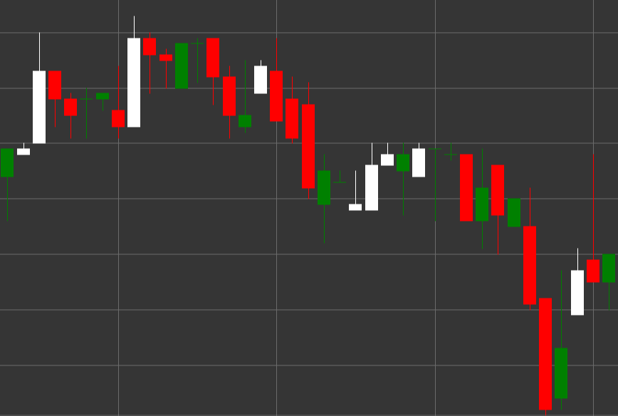

# Паттерн Inverted Hammer (Перевернутый Молот)

Inverted Hammer (Перевернутый Молот) - это бычий свечной паттерн, который формируется во время нисходящего тренда. Свеча имеет маленькое тело в нижней части и длинную верхнюю тень, при этом нижняя тень отсутствует или очень короткая. Внешне выглядит как перевернутый молоток.

##### Ключевые особенности:

- Цена открытия ниже цены закрытия (O < C), хотя может быть и наоборот.
- Маленькое тело свечи в нижней части диапазона цен.
- Длинная верхняя тень, которая обычно в 2-3 раза длиннее тела.
- Отсутствие или очень короткая нижняя тень.
- Формируется в нисходящем тренде.

### Интерпретация

Inverted Hammer считается потенциальным сигналом разворота нисходящего тренда:

- Длинная верхняя тень показывает, что покупатели пытались поднять цену значительно выше, но не смогли удержать её на высоких уровнях.
- Несмотря на неспособность закрыться на максимумах, появление покупателей после продолжительного нисходящего тренда может сигнализировать о смене настроения.
- Этот паттерн не так силен, как классический Hammer, и требует подтверждения от последующих свечей.
- Цвет тела менее важен, хотя белый/зеленый Inverted Hammer считается более бычьим.

### Торговые стратегии

Inverted Hammer требует осторожного подхода и подтверждения:

- Обязательное ожидание подтверждения от следующей свечи - сильная бычья свеча после Inverted Hammer значительно увеличивает вероятность разворота.
- Размещение уровня стоп-лосса ниже минимума Inverted Hammer.
- Использование меньшего объема позиции по сравнению с более надежными паттернами разворота.
- Комбинирование с индикаторами перепроданности, такими как RSI или Stochastic, для повышения вероятности успешной сделки.
- Обращение внимания на объем торгов - высокий объем повышает значимость сигнала.

## См. также

[Pattern Hammer](hammer.md)

[Pattern Shooting Star](shooting_star.md)
