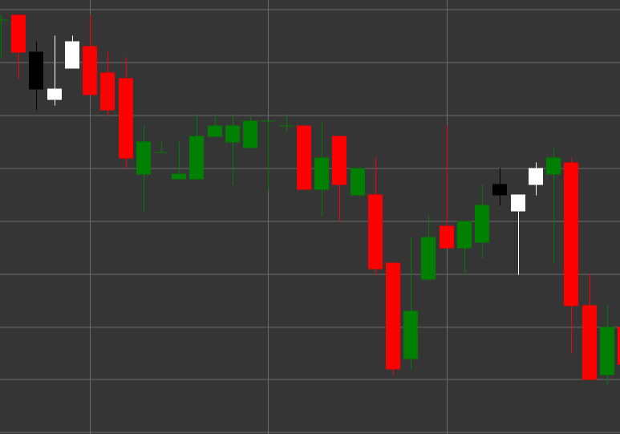

# Паттерн Morning Star (Утренняя звезда)

Morning Star (Утренняя звезда) - это бычий разворотный свечной паттерн, состоящий из трех свечей, который формируется в нисходящем тренде. Этот паттерн показывает переход от медвежьего настроения к бычьему через период неопределенности или консолидации.

##### Ключевые особенности:

- Первая свеча черная (медвежья) с ценой открытия выше цены закрытия (O > C).
- Вторая свеча имеет маленькое тело (может быть как бычьей, так и медвежьей) и образует ценовой разрыв (гэп) вниз от первой свечи. Тело свечи значительно меньше тела первой свечи (B < pB * 0.5m).
- Третья свеча белая (бычья) с ценой открытия ниже цены закрытия (O < C), которая закрывается глубоко внутри тела первой свечи.
- Формируется в нисходящем тренде.

### Интерпретация

Morning Star считается сильным сигналом потенциального разворота нисходящего тренда:

- Первая свеча подтверждает силу медвежьего тренда.
- Вторая свеча (звезда) показывает ослабление медвежьего давления и неопределенность на рынке.
- Третья свеча демонстрирует возвращение покупателей и смену контроля с медведей на быков.
- Чем глубже третья свеча проникает в тело первой свечи, тем сильнее сигнал разворота.
- Если вторая свеча является дожи (с очень маленьким телом), паттерн называется "Утренняя звезда дожи" и считается еще более сильным сигналом.

### Торговые стратегии

Morning Star предоставляет хорошие возможности для входа в длинную позицию:

- Вход в длинную позицию после формирования паттерна, обычно на открытии четвертой свечи или при пробое максимума третьей свечи.
- Размещение стоп-лосса ниже минимума второй свечи или минимума всего паттерна.
- Целевая прибыль может быть установлена на основе фибоначчи-уровней относительно предыдущего нисходящего движения или предыдущих уровней сопротивления.
- Обращение внимания на объем - увеличение объема на третьей свече подтверждает силу бычьего разворота.
- Комбинирование с другими техническими индикаторами, такими как RSI в зоне перепроданности или линии поддержки, для повышения надежности сигнала.

## См. также

[Pattern Evening Star](evening_star.md)

[Pattern Three White Soldiers](three_white_soldiers.md)
