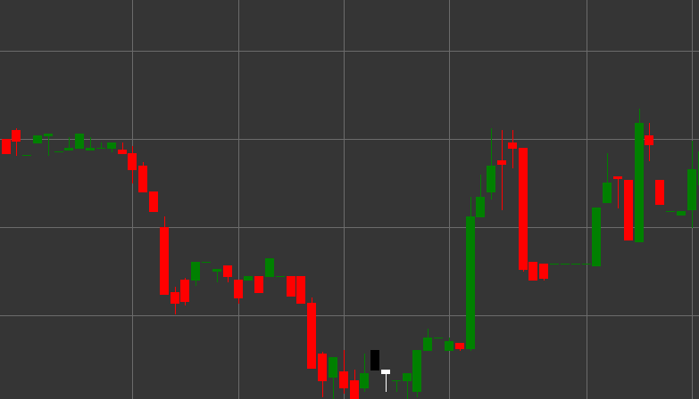

# Паттерн On-Neck (На шее)

On-Neck (На шее) - это медвежий свечной паттерн продолжения тренда, состоящий из двух свечей, который формируется в нисходящем тренде. Этот паттерн показывает временную неудачную попытку быков развернуть тренд, после чего нисходящее движение продолжается.

##### Ключевые особенности:

- Первая свеча черная (медвежья) с ценой открытия выше цены закрытия (O > C) и относительно длинным телом.
- Вторая свеча белая (бычья) с ценой открытия ниже цены закрытия ((C > O) && (ABS(pL - C) <= 1)).
- Цена закрытия второй свечи около (или на уровне) минимума первой свечи.
- Формируется в нисходящем тренде.

### Интерпретация

On-Neck считается сигналом продолжения нисходящего тренда:

- Первая свеча подтверждает существующий нисходящий тренд.
- Вторая свеча начинается с гэпа вниз, что свидетельствует о продолжении медвежьего давления.
- Однако во время сессии быки предпринимают попытку развернуть движение, но могут поднять цену только до минимума предыдущей свечи.
- Закрытие второй свечи на уровне минимума первой свечи указывает на то, что покупатели не смогли преодолеть этот уровень сопротивления.
- Это сигнализирует о вероятном продолжении нисходящего тренда.

### Торговые стратегии

On-Neck предоставляет возможности для входа или усиления коротких позиций:

- Вход в короткую позицию или добавление к существующей короткой позиции после формирования паттерна, обычно на открытии третьей свечи.
- Размещение стоп-лосса выше максимума второй свечи или для большей защиты - выше максимума первой свечи.
- Целевая прибыль может быть установлена на основе предыдущих уровней поддержки или с использованием технических методов измерения, таких как проекция высоты первой свечи.
- Обращение внимания на объем - снижение объема на второй свече и увеличение на последующих медвежьих свечах усиливает достоверность сигнала.
- Комбинирование с другими индикаторами и паттернами для повышения вероятности успешной сделки.

