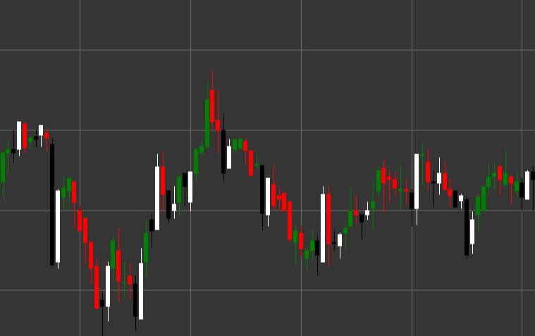

# Паттерн Piercing (Пробивающий паттерн)

Piercing (Пробивающий паттерн) - это бычий разворотный свечной паттерн, состоящий из двух свечей, который формируется в нисходящем тренде. Первая свеча черная (медвежья), за которой следует белая (бычья) свеча, открывающаяся ниже минимума предыдущей свечи и закрывающаяся выше середины тела предыдущей свечи.

##### Ключевые особенности:

- Первая свеча черная с ценой открытия выше цены закрытия (O > C).
- Вторая свеча белая с ценой открытия ниже цены закрытия (O < C).
- Цена закрытия второй свечи проникает глубоко в тело первой свечи, закрываясь выше середины первой свечи (C > (pB / 2 + pC)).
- Формируется в нисходящем тренде.

### Интерпретация

Piercing считается надежным сигналом потенциального разворота нисходящего тренда:

- Открытие второй свечи ниже минимума первой свечи (гэп вниз) показывает продолжение медвежьего давления.
- Однако во время торговой сессии быки перехватывают контроль и поднимают цену значительно выше, закрывая свечу выше середины тела предыдущей свечи.
- Это демонстрирует резкую смену настроения от медвежьего к бычьему.
- Чем глубже проникновение во вторую половину тела первой свечи, тем сильнее сигнал.
- Если цена закрытия второй свечи выше цены открытия первой свечи, паттерн переходит в категорию "Бычье поглощение" (Bullish Engulfing), что считается еще более сильным сигналом.

### Торговые стратегии

Piercing предоставляет хорошие возможности для входа в длинную позицию:

- Вход в позицию после подтверждения паттерна (обычно на открытии третьей свечи или при пробое максимума второй свечи).
- Размещение стоп-лосса ниже минимума второй свечи или минимума всего паттерна.
- Целевая прибыль может быть установлена на основе предыдущих уровней сопротивления или фибоначчи-уровней.
- Учет объема торгов - высокий объем во время формирования второй свечи усиливает достоверность сигнала.
- Дополнительное подтверждение от индикаторов перепроданности, таких как RSI или Stochastic, повышает вероятность успешной сделки.

## См. также

[Pattern Bullish Engulfing](bullish_engulfing.md)