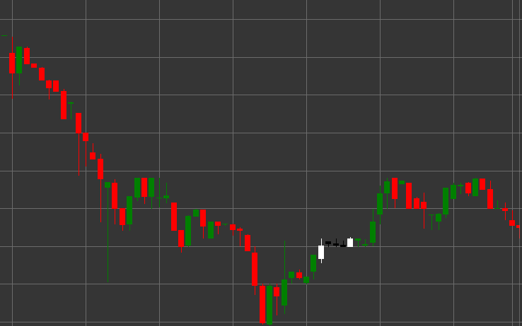

# Паттерн Rising Three Methods (Восходящие три метода)

Rising Three Methods (Восходящие три метода) - это бычий паттерн продолжения тренда, состоящий из пяти свечей, который формируется в восходящем тренде. Этот паттерн показывает временную консолидацию или отдых в рамках существующего восходящего тренда перед его продолжением.

##### Ключевые особенности:

- Первая свеча белая (бычья) с ценой открытия ниже цены закрытия (O < C) и длинным телом.
- Следующие три свечи черные (медвежьи) с ценой открытия выше цены закрытия (O > C), с небольшими телами: (B < pB * 0.5m), (B < ppB * 0.5m), (B < pppB * 0.5m).
- Тела трех средних свечей не выходят за пределы диапазона первой свечи.
- Пятая свеча белая (бычья) с ценой открытия ниже цены закрытия (O < C) и длинным телом (B > pB * 2).
- Пятая свеча пробивает максимум первой свечи и закрывается выше.
- Формируется в восходящем тренде.

### Интерпретация

Rising Three Methods считается надежным сигналом продолжения восходящего тренда:

- Первая длинная белая свеча показывает силу восходящего тренда.
- Три небольшие черные свечи представляют собой временную консолидацию или коррекцию, во время которой продавцы не смогли существенно изменить тренд.
- Пятая длинная белая свеча подтверждает возвращение контроля к покупателям и продолжение восходящего тренда.
- Этот паттерн можно рассматривать как флаг или вымпел в классическом техническом анализе.
- Такая последовательность свечей указывает на то, что коррекция была использована для накопления длинных позиций перед продолжением движения вверх.

### Торговые стратегии

Rising Three Methods предоставляет хорошие возможности для входа или усиления длинных позиций:

- Вход в длинную позицию на открытии после пятой свечи или при пробое максимума первой свечи.
- Размещение стоп-лосса ниже минимума коррекционных свечей или ниже минимума первой свечи.
- Целевая прибыль может быть установлена с использованием проекции, равной расстоянию от начала тренда до первой свечи паттерна.
- Обращение внимания на объем - идеально, когда объем снижается на трех средних свечах и значительно увеличивается на пятой свече.
- Комбинирование с другими техническими индикаторами для подтверждения сигнала.
- Учет важных уровней сопротивления выше текущей цены, которые могут повлиять на развитие движения.

## См. также

[Pattern Falling Three Methods](falling_three_methods.md)

[Pattern Three White Soldiers](three_white_soldiers.md)
