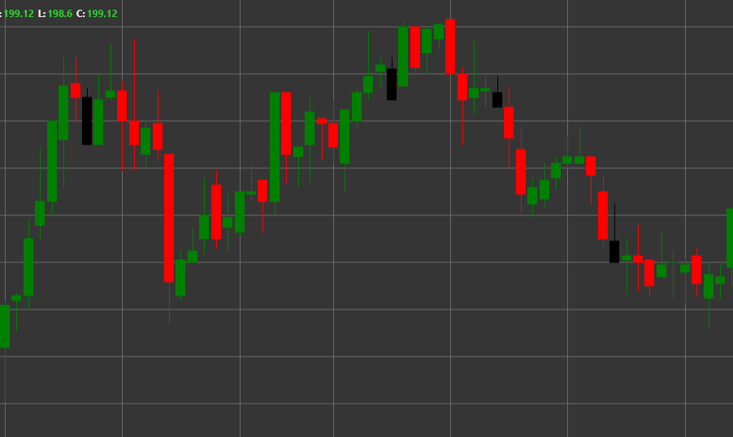

# Паттерн Shooting Star (Падающая звезда)

Shooting Star (Падающая звезда) - это медвежий разворотный свечной паттерн, который формируется в восходящем тренде. Свеча имеет маленькое тело в нижней части и длинную верхнюю тень, при этом нижняя тень отсутствует или очень короткая. Своим видом напоминает звезду с хвостом, направленным вверх.

##### Ключевые особенности:

- Цена открытия выше цены закрытия (O > C), хотя может быть и наоборот.
- Маленькое тело свечи в нижней части диапазона цен.
- Длинная верхняя тень, которая обычно в 2-3 раза длиннее тела.
- Отсутствие или очень короткая нижняя тень (BS == 0).
- Формируется в восходящем тренде.

### Интерпретация

Shooting Star считается сильным сигналом потенциального разворота восходящего тренда:

- Длинная верхняя тень показывает, что цена значительно выросла во время торговой сессии, но затем продавцы вмешались и оттеснили цену вниз.
- Это указывает на отвержение рынком более высоких цен и потенциальную смену настроения с бычьего на медвежье.
- Чем длиннее верхняя тень, тем сильнее потенциальный разворотный сигнал.
- Цвет тела свечи имеет меньшее значение, хотя черный/красный Shooting Star считается более медвежьим, чем белый/зеленый.
- Паттерн похож на Inverted Hammer, но формируется в восходящем тренде и имеет противоположное значение.

### Торговые стратегии

Shooting Star предоставляет возможности для входа в короткую позицию:

- Ожидание подтверждения от следующей свечи - медвежья свеча после Shooting Star усиливает сигнал разворота.
- Размещение уровня стоп-лосса выше максимума Shooting Star.
- Установка целевой прибыли на основе предыдущих уровней поддержки или соотношения риск/прибыль.
- Комбинирование с другими техническими индикаторами, такими как RSI в зоне перекупленности или MACD с медвежьей дивергенцией, для подтверждения разворота тренда.
- Более высокий объем торгов во время формирования Shooting Star повышает надежность сигнала.
- Особенно сильный сигнал, если Shooting Star формируется на важном уровне сопротивления или после стремительного роста цены.

## См. также

[Pattern Inverted Hammer](inverted_hammer.md)

[Pattern Hanging Man](hanging_man.md)
