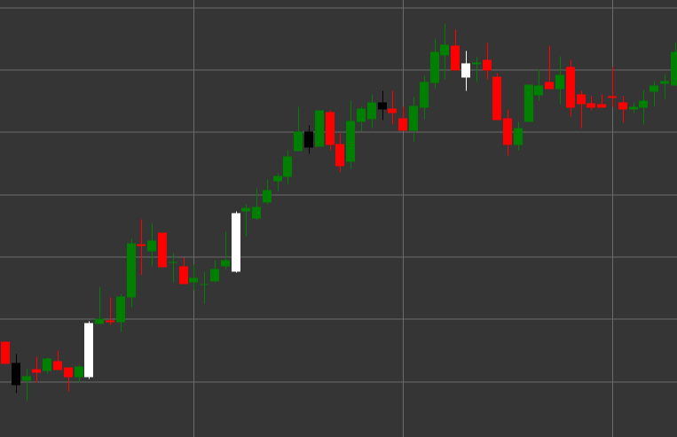

# Паттерн Spinning Top (Волчок)

Spinning Top (Волчок) - это свечной паттерн, характеризующийся небольшим телом свечи и длинными верхней и нижней тенями примерно одинаковой длины. Этот паттерн указывает на нерешительность рынка и борьбу между покупателями и продавцами.

##### Ключевые особенности:

- Маленькое тело свечи (может быть как белым/зеленым, так и черным/красным).
- Длинные верхняя и нижняя тени примерно равной длины.
- Указывает на равновесие между быками и медведями.
- Отражает нерешительность рынка и потенциальную смену тренда.

### Интерпретация

Spinning Top сигнализирует о нерешительности на рынке:

- Длинные тени показывают, что в течение периода цена значительно колебалась как вверх, так и вниз.
- Маленькое тело означает, что цена закрытия недалеко ушла от цены открытия, несмотря на высокую волатильность.
- В рамках восходящего тренда может сигнализировать о ослаблении бычьего импульса.
- В рамках нисходящего тренда может указывать на исчерпание медвежьего давления.
- На вершине тренда или перед важным уровнем сопротивления может предвещать разворот.

### Торговые стратегии

Spinning Top сам по себе не является сильным торговым сигналом, но может использоваться в комбинации с другими факторами:

- Поиск дополнительного подтверждения от последующих свечей перед принятием торговых решений.
- Использование в составе более сложных свечных паттернов, таких как утренняя или вечерняя звезда.
- Увеличение внимания к последующим ценовым движениям после формирования Spinning Top на ключевых уровнях поддержки или сопротивления.
- Возможность сужения стоп-лоссов при появлении Spinning Top после продолжительного тренда.

## См. также

[Pattern Hammer](hammer.md)

[Pattern Inverted Hammer](inverted_hammer.md)
