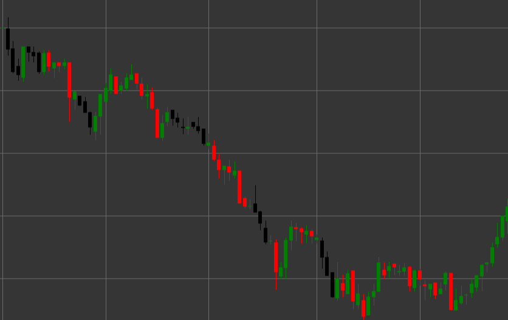

# Паттерн Three Black Crows (Три черных вороны)

Three Black Crows (Три черных вороны) - это мощный медвежий разворотный свечной паттерн, состоящий из трех последовательных свечей, который формируется в восходящем тренде. Этот паттерн указывает на решительный переход контроля от покупателей к продавцам, сигнализируя о потенциальном развороте восходящего тренда.

##### Ключевые особенности:

- Три последовательные черные (медвежьи) свечи с ценой открытия выше цены закрытия (O > C).
- Каждая следующая свеча открывается в пределах тела предыдущей свечи (O < pO).
- Каждая свеча закрывается ниже закрытия предыдущей свечи.
- Все три свечи имеют относительно длинные тела и короткие тени.
- Формируется в восходящем тренде.

### Интерпретация

Three Black Crows считается одним из самых надежных сигналов разворота восходящего тренда:

- Последовательность из трех падающих свечей показывает устойчивое увеличение медвежьего давления.
- Открытие каждой следующей свечи внутри тела предыдущей указывает на некоторую консолидацию, а затем продолжение медвежьего движения.
- Закрытие каждой свечи ниже предыдущей демонстрирует способность продавцов последовательно снижать цену.
- Относительно длинные тела свечей с короткими тенями указывают на решительный контроль медведей над рынком.
- Чем более равномерны размеры трех свечей, тем сильнее сигнал.

### Торговые стратегии

Three Black Crows предоставляет надежные возможности для входа в короткую позицию:

- Вход в короткую позицию после формирования полного паттерна, обычно на открытии четвертой свечи.
- Размещение стоп-лосса выше максимума третьей свечи или над максимумом всего паттерна.
- Целевая прибыль может быть установлена на основе фибоначчи-уровней или предыдущих уровней поддержки.
- Обращение внимания на объем - увеличение объема с каждой свечой подтверждает силу сигнала.
- Более осторожный подход при слишком длинных телах свечей, так как может последовать краткосрочная коррекция из-за перепроданности.
- Комбинирование с другими техническими индикаторами, такими как RSI в зоне перекупленности, для повышения вероятности успешной сделки.
- Особенно сильный сигнал, если паттерн формируется после продолжительного восходящего тренда или на важном уровне сопротивления.

## См. также

[Pattern Three White Soldiers](three_white_soldiers.md)

[Pattern Falling Three Methods](falling_three_methods.md)
