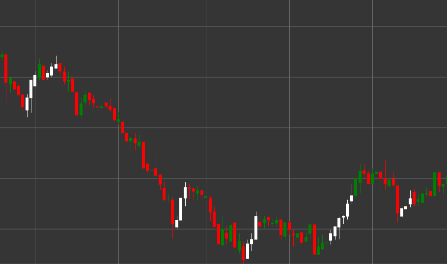

# Паттерн Three White Soldiers (Три белых солдата)

Three White Soldiers (Три белых солдата) - это мощный бычий разворотный свечной паттерн, состоящий из трех последовательных свечей, который формируется в нисходящем тренде. Этот паттерн указывает на решительный переход контроля от продавцов к покупателям, сигнализируя о потенциальном развороте нисходящего тренда.

##### Ключевые особенности:

- Три последовательные белые (бычьи) свечи с ценой открытия ниже цены закрытия (O < C).
- Каждая следующая свеча открывается в пределах тела предыдущей свечи (O > pO).
- Каждая свеча закрывается выше закрытия предыдущей свечи.
- Все три свечи имеют относительно длинные тела и короткие тени.
- Формируется в нисходящем тренде.

### Интерпретация

Three White Soldiers считается одним из самых надежных сигналов разворота нисходящего тренда:

- Последовательность из трех растущих свечей показывает устойчивое увеличение бычьего давления.
- Открытие каждой следующей свечи внутри тела предыдущей указывает на некоторую консолидацию, а затем продолжение бычьего движения.
- Закрытие каждой свечи выше предыдущей демонстрирует способность покупателей последовательно поднимать цену.
- Относительно длинные тела свечей с короткими тенями указывают на решительный контроль быков над рынком.
- Чем более равномерны размеры трех свечей, тем сильнее сигнал.

### Торговые стратегии

Three White Soldiers предоставляет надежные возможности для входа в длинную позицию:

- Вход в длинную позицию после формирования полного паттерна, обычно на открытии четвертой свечи.
- Размещение стоп-лосса ниже минимума третьей свечи или под минимумом всего паттерна.
- Целевая прибыль может быть установлена на основе фибоначчи-уровней или предыдущих уровней сопротивления.
- Обращение внимания на объем - увеличение объема с каждой свечой подтверждает силу сигнала.
- Более осторожный подход при слишком длинных телах свечей, так как может последовать краткосрочная коррекция из-за перекупленности.
- Комбинирование с другими техническими индикаторами, такими как RSI, для повышения вероятности успешной сделки.

## См. также

[Pattern Three Black Crows](three_black_crows.md)

[Pattern Rising Three Methods](rising_three_methods.md)
