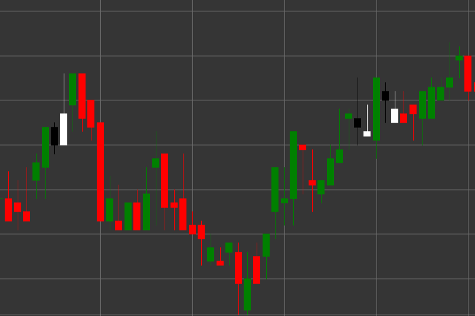

# Паттерн Tweezer Bottom (Дно пинцета)

Tweezer Bottom (Дно пинцета) - это бычий разворотный свечной паттерн, состоящий из двух свечей, который формируется в нисходящем тренде. Характерной особенностью паттерна является то, что обе свечи имеют одинаковый или почти одинаковый минимум, напоминая пинцет с двумя одинаковыми концами.

##### Ключевые особенности:

- Первая свеча черная (медвежья) с ценой открытия выше цены закрытия (O > C).
- Вторая свеча белая (бычья) с ценой открытия ниже цены закрытия (O < C).
- У второй свечи отсутствует или очень короткая нижняя тень (BS == 0).
- Верхняя тень второй свечи больше тела (TS > B).
- Обе свечи имеют одинаковый или очень близкий минимум.
- Формируется в нисходящем тренде.

### Интерпретация

Tweezer Bottom считается сигналом потенциального разворота нисходящего тренда:

- Первая свеча подтверждает существующий нисходящий тренд.
- Вторая свеча с таким же минимумом показывает, что медведи дважды пытались пробить один и тот же уровень, но не смогли.
- Эта неспособность преодолеть определенный уровень указывает на ослабление медвежьего импульса и возможное начало бычьего движения.
- Отсутствие нижней тени у второй свечи при наличии длинной верхней тени указывает на сильное бычье давление от уровня минимума.
- Паттерн особенно значим, если формируется на важном уровне поддержки или после продолжительного нисходящего движения.

### Торговые стратегии

Tweezer Bottom требует осторожного подхода и часто дополнительного подтверждения:

- Ожидание подтверждающей бычьей свечи после формирования паттерна перед входом в длинную позицию.
- Размещение стоп-лосса немного ниже общего минимума паттерна.
- Учет объема торгов - снижение объема на первой свече и увеличение на второй и последующих бычьих свечах усиливает сигнал.
- Комбинирование с другими техническими индикаторами, такими как RSI в зоне перепроданности или бычья дивергенция на осцилляторах.
- Возможное использование для частичного или полного закрытия существующих коротких позиций.
- Обращение особого внимания на последующие ценовые движения - быстрый рост цены после паттерна подтверждает его значимость.

## См. также

[Pattern Tweezer Top](tweezer_top.md)

[Pattern Morning Star](morning_star.md)
