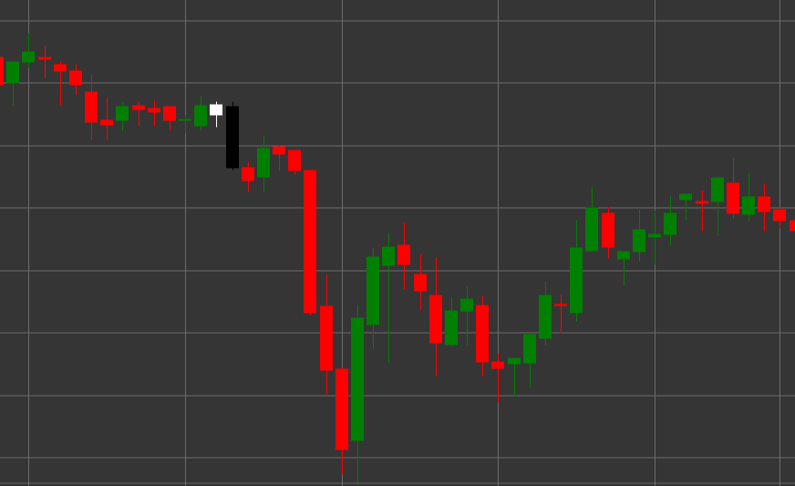

# Паттерн Tweezer Top (Вершина пинцета)

Tweezer Top (Вершина пинцета) - это медвежий разворотный свечной паттерн, состоящий из двух свечей, который формируется в восходящем тренде. Характерной особенностью паттерна является то, что обе свечи имеют одинаковый или почти одинаковый максимум, напоминая пинцет с двумя одинаковыми концами.

##### Ключевые особенности:

- Первая свеча белая (бычья) с ценой открытия ниже цены закрытия (O < C).
- Вторая свеча черная (медвежья) с ценой открытия выше цены закрытия (O > C).
- Обе свечи имеют одинаковый или очень близкий максимум (H == pH).
- Тело второй свечи значительно больше тела первой свечи (B > (pB * 3)).
- Формируется в восходящем тренде.

### Интерпретация

Tweezer Top считается сигналом потенциального разворота восходящего тренда:

- Первая свеча подтверждает существующий восходящий тренд.
- Вторая свеча с таким же максимумом показывает, что быки дважды пытались пробить один и тот же уровень, но не смогли.
- Эта неспособность преодолеть определенный уровень указывает на ослабление бычьего импульса и возможное начало медвежьего движения.
- Более значительное тело второй свечи по сравнению с первой усиливает медвежий сигнал.
- Паттерн особенно значим, если формируется на важном уровне сопротивления или после продолжительного восходящего движения.

### Торговые стратегии

Tweezer Top требует осторожного подхода и часто дополнительного подтверждения:

- Ожидание подтверждающей медвежьей свечи после формирования паттерна перед входом в короткую позицию.
- Размещение стоп-лосса немного выше общего максимума паттерна.
- Учет объема торгов - снижение объема на первой свече и увеличение на второй и последующих медвежьих свечах усиливает сигнал.
- Комбинирование с другими техническими индикаторами, такими как RSI в зоне перекупленности или дивергенция на осцилляторах.
- Возможное использование для частичного или полного закрытия существующих длинных позиций.
- Обращение особого внимания на последующие ценовые движения - быстрое снижение цены после паттерна подтверждает его значимость.

## См. также

[Pattern Tweezer Bottom](tweezer_bottom.md)

[Pattern Evening Star](evening_star.md)
