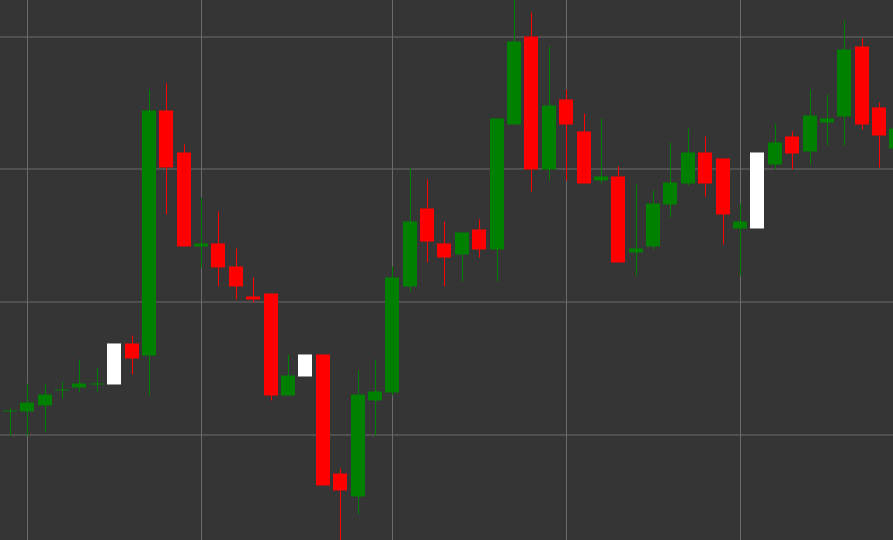

# Паттерн White Marubozu (Белый Марубозу)

White Marubozu (Белый Марубозу) - это бычий свечной паттерн, который характеризуется отсутствием теней на обоих концах свечи. Термин "марубозу" происходит от японского слова, означающего "бритоголовый" или "стриженный", что отражает внешний вид свечи без теней.

##### Ключевые особенности:

- Цена открытия ниже цены закрытия (O < C).
- Тело свечи полностью заполнено, без верхней и нижней тени.
- Цена открытия равна минимуму свечи, а цена закрытия равна максимуму свечи.
- Представляет собой сильное бычье движение, где покупатели контролировали цену на протяжении всего периода.

### Интерпретация

White Marubozu считается сильным бычьим сигналом:

- Отсутствие теней указывает на полную доминацию покупателей - цена открылась на минимуме и непрерывно росла до закрытия периода.
- Длинный White Marubozu свидетельствует об очень сильном бычьем давлении.
- Появление этого паттерна после нисходящего тренда может сигнализировать о развороте.
- В рамках восходящего тренда подтверждает силу движения.

### Торговые стратегии

White Marubozu предоставляет более сильный сигнал, чем обычная белая свеча:

- Возможность входа в длинную позицию после формирования White Marubozu, особенно если он появляется на важном уровне поддержки.
- Использование цены закрытия White Marubozu как уровня поддержки при установке стоп-лоссов.
- Сочетание с другими техническими индикаторами для подтверждения сигнала.
- Обращение внимания на объем торгов - высокий объем усиливает значимость сигнала.

## См. также

[Pattern Black Marubozu](black_marubozu.md)

[Pattern White Candle](white_candle.md)
