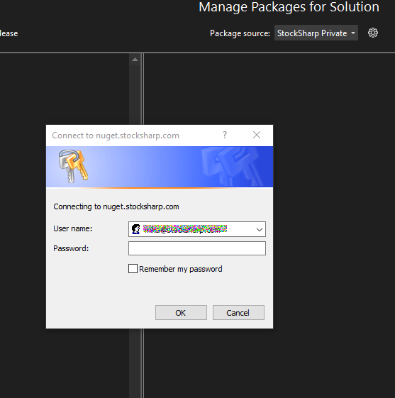

# Установка API

NuGet - система управления пакетами, интегрированная в Visual Studio. Она позволяет легко устанавливать и обновлять пакеты, включая [S#](../api.md).

Все пакеты [S#](../api.md) скомпилированы под .NET 6. Это кросс-платформенная версия (коннекторы, [бэктестинг](testing.md), [хранилище](market_data_storage.md) и т.д. доступны в любой ОС), но [графические компоненты](graphical_user_interface.md) поддерживаются только под Windows.

## Публичный NuGet сервер

1. Нажмите правой кнопкой мыши на проекте и выберите **Manage NuGet Packages...** в контекстном меню:

2. Появится окно как на картинке:

3. В правом верхнем углу в поле Search (в русской версии Поиск) необходимо написать StockSharp:

4. [S#](../api.md) разделен на несколько NuGet пакетов:
  - [StockSharp.Algo](https://www.nuget.org/packages/StockSharp.Algo/) - базовые алгоритмы и [тестирование](testing.md)
  - [StockSharp.Binance](https://www.nuget.org/packages/StockSharp.Binance/) - [коннекторы](connectors.md) к брокерам
  - [StockSharp.Xaml.Charting](https://www.nuget.org/packages/StockSharp.Xaml.Charting/) - [графические компоненты](graphical_user_interface.md) для отображения графиков свечей и [индикаторов](indicators.md)

При выборе пакета все зависимости будут установлены автоматически.

5. Выберите нужный пакет и нажмите **Install**:

6. После установки файлы [S#](../api.md) будут добавлены в папку packages и подключены как ссылки в проекте.

[Примеры](examples.md) торговых роботов доступны на [GitHub](https://github.com/stocksharp/stocksharp/tree/master/Samples).

## Закрытый NuGet сервер 

Некоторые компоненты (например, крипто-[коннекторы](connectors.md)) доступны только через закрытый NuGet сервер для зарегистрированных пользователей.

Для подключения доступны два способа:

### Способ 1: Авторизация через токен в адресе

1. Зарегистрируйтесь на сайте StockSharp.

2. Скопируйте токен из [личного кабинета](https://stocksharp.ru/profile/):

3. Проделайте шаги 1 и 2 из раздела **Публичный NuGet сервер** и откройте окно настроек доступных фидов:

4. В появившемся окне добавьте новый фид, указав адрес как `https://nuget.stocksharp.com/{token}/v3/index.json`. Например, `https://nuget.stocksharp.com/AAHBWDNOINXWNJNWD/v3/index.json`:

5. Нажмите **ОК** и выберите в фидах созданный. В случае наличия доступа к тем или иным закрытым компонентам появится список доступных NuGet пакетов:

6. Выберите нужный и нажмите кнопку **Install**.

### Способ 2: Авторизация через логин и пароль

1. Добавьте источник пакетов с адресом `https://nuget.stocksharp.com/x/v3/index.json`.

2. После добавления источника, при попытке его использования, появится окно авторизации:

3. Введите свой логин и пароль от аккаунта StockSharp. Можно сохранить учетные данные, чтобы не вводить их каждый раз.

4. После успешной авторизации вы получите доступ к закрытым пакетам.

5. Если вы предпочитаете авторизацию по токену, можно ввести в поле логина значение "x", а в поле пароля — ваш токен.

Если вам нужно сбросить сохраненные учетные данные:
1. Откройте "Credential Manager" в Windows (Панель управления → Учетные данные пользователей → Диспетчер учетных данных)
2. Найдите в списке VSCredentials, связанные с nuget.stocksharp.com
3. Удалите эти учетные данные

## Обновление пакетов

Для проверки обновлений:

1. Откройте **Manage NuGet Packages...**
2. Перейдите на вкладку **Updates**
3. Выберите пакеты для обновления и нажмите **Update**

> [!WARNING]
> Для проверки обновлений на публичном и закрытом серверах необходимо переключать источник пакетов, так как VS 2019 не отслеживает несколько источников одновременно.

## Installer

[Installer](../installer.md) - специальное приложение для упрощенной установки всех продуктов StockSharp.