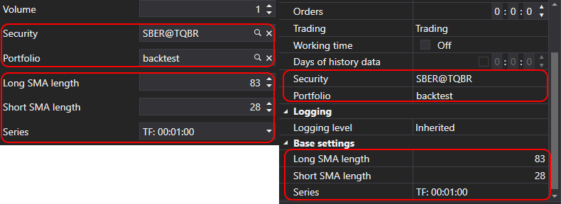

# Параметры стратегии

Для настройки стратегии и проведения оптимизации StockSharp предоставляет специальный класс [StrategyParam\<T\>](xref:StockSharp.Algo.Strategies.StrategyParam`1). Параметры стратегии позволяют изменять настройки торгового алгоритма без модификации программного кода, что особенно удобно при переключении между режимами тестирования и реальной торговли. Кроме того, эти параметры используются в процессе оптимизации для автоматического перебора значений и поиска оптимальных настроек стратегии.

В отличие от обычных свойств C#, параметры, созданные с помощью этого класса, автоматически отображаются в визуальных настройках (например, в Дизайнере) и могут использоваться при оптимизации стратегий.

## Создание параметров стратегии

Параметры создаются в конструкторе стратегии с помощью метода [Strategy.Param](xref:StockSharp.Algo.Strategies.Strategy.Param``1(System.String,``0)):

```cs
public class SmaStrategy : Strategy
{
	private readonly StrategyParam<int> _longSmaLength;

	public int LongSmaLength
	{
		get => _longSmaLength.Value;
		set => _longSmaLength.Value = value;
	}

	public SmaStrategy()
	{
		_longSmaLength = Param(nameof(LongSmaLength), 80)
							.SetGreaterThanZero()
							.SetDisplay("Long SMA length", string.Empty, "Base settings");
	}
}
```

В этом примере создается параметр `LongSmaLength` с начальным значением 80, задается валидатор для проверки, что значение будет больше нуля, и устанавливаются настройки отображения в пользовательском интерфейсе.

## Методы настройки параметров

Класс [StrategyParam\<T\>](xref:StockSharp.Algo.Strategies.StrategyParam`1) предоставляет несколько методов для настройки параметра:

### SetDisplay

Метод [StrategyParam\<T\>.SetDisplay](xref:StockSharp.Algo.Strategies.StrategyParam`1.SetDisplay(System.String,System.String,System.String)) задает отображаемое имя, описание и категорию параметра:

```cs
_longSmaLength = Param(nameof(LongSmaLength), 80)
					.SetDisplay("Long SMA length", "Период длинной скользящей средней", "Основные настройки");
```

### SetValidator

Метод [StrategyParam\<T\>.SetValidator](xref:Ecng.ComponentModel.Extensions.SetValidator``1(``0,System.ComponentModel.DataAnnotations.ValidationAttribute)) устанавливает валидатор для проверки значения параметра. StockSharp предоставляет ряд предопределенных валидаторов, которые можно использовать для наиболее распространенных задач:

```cs
// Проверка, что число больше нуля
_longSmaLength = Param(nameof(LongSmaLength), 80)
					.SetValidator(new IntGreaterThanZeroAttribute());

// Проверка, что число не отрицательное
_volume = Param(nameof(Volume), 1)
			.SetValidator(new DecimalNotNegativeAttribute());

// Проверка на диапазон значений
_percentage = Param(nameof(Percentage), 50)
				.SetValidator(new RangeAttribute(0, 100));

// Проверка на обязательное значение
_security = Param<Security>(nameof(Security))
				.SetValidator(new RequiredAttribute());
```

Для удобства в [StrategyParam\<T\>](xref:StockSharp.Algo.Strategies.StrategyParam`1) есть встроенные методы для наиболее распространенных валидаторов:

```cs
// Проверка, что число больше нуля
_longSmaLength = Param(nameof(LongSmaLength), 80).SetGreaterThanZero();

// Проверка, что число не отрицательное
_volume = Param(nameof(Volume), 1).SetNotNegative();

// Проверка, что значение NULL или не отрицательное
_interval = Param<TimeSpan?>(nameof(Interval)).SetNullOrNotNegative();

// Установка диапазона значений
_percentage = Param(nameof(Percentage), 50).SetRange(0, 100);
```

Если встроенных валидаторов недостаточно, вы можете создать свой собственный, унаследовав его от [ValidationAttribute](https://docs.microsoft.com/ru-ru/dotnet/api/system.componentmodel.dataannotations.validationattribute):

```cs
public class EvenNumberAttribute : ValidationAttribute
{
	public EvenNumberAttribute()
		: base("Значение должно быть четным числом.")
	{
	}

	public override bool IsValid(object value)
	{
		if (value is int intValue)
			return intValue % 2 == 0;
		
		return false;
	}
}

// Использование пользовательского валидатора
_barCount = Param(nameof(BarCount), 10)
				.SetValidator(new EvenNumberAttribute());
```

### SetHidden

Метод [StrategyParam\<T\>.SetHidden](xref:StockSharp.Algo.Strategies.StrategyParam`1.SetHidden(System.Boolean)) скрывает параметр в редакторе свойств:

```cs
_systemParam = Param(nameof(SystemParam), "value")
				.SetHidden(true);
```

### SetBasic

Метод [StrategyParam\<T\>.SetBasic](xref:StockSharp.Algo.Strategies.StrategyParam`1.SetBasic(System.Boolean)) отмечает параметр как базовый, что влияет на его отображение в пользовательском интерфейсе. Базовые параметры отображаются в упрощенном режиме редактора свойств:

```cs
_longSmaLength = Param(nameof(LongSmaLength), 80)
					.SetBasic(true);
```



### SetReadOnly

Метод [StrategyParam\<T\>.SetReadOnly](xref:StockSharp.Algo.Strategies.StrategyParam`1.SetReadOnly(System.Boolean)) делает параметр только для чтения:

```cs
_calculatedParam = Param(nameof(CalculatedParam), 0)
					.SetReadOnly(true);
```

### SetCanOptimize и SetOptimize

Методы [StrategyParam\<T\>.SetCanOptimize](xref:StockSharp.Algo.Strategies.StrategyParam`1.SetCanOptimize(System.Boolean)) и [StrategyParam\<T\>.SetOptimize](xref:StockSharp.Algo.Strategies.StrategyParam`1.SetOptimize(`0,`0,`0)) указывают, может ли параметр использоваться для оптимизации, и задают диапазон значений для оптимизации:

```cs
_longSmaLength = Param(nameof(LongSmaLength), 80)
					.SetCanOptimize(true)
					.SetOptimize(10, 200, 10);
```

В примере выше параметр будет оптимизироваться в диапазоне от 10 до 200 с шагом 10.

## Использование параметров в стратегии

Параметры стратегии используются так же, как обычные свойства:

```cs
protected override void OnStarted2(DateTime time)
{
	base.OnStarted2(time);

	_shortSma = new SimpleMovingAverage { Length = ShortSmaLength };
	_longSma = new SimpleMovingAverage { Length = LongSmaLength };

	// ...
}
```

## Сохранение и загрузка параметров

Значения параметров автоматически сохраняются и загружаются в базовом классе [Strategy](xref:StockSharp.Algo.Strategies.Strategy). При переопределении методов [Strategy.Save](xref:StockSharp.Algo.Strategies.Strategy.Save(Ecng.Serialization.SettingsStorage)) и [Strategy.Load](xref:StockSharp.Algo.Strategies.Strategy.Load(Ecng.Serialization.SettingsStorage)) необходимо вызывать методы базового класса:

```cs
public override void Save(SettingsStorage settings)
{
	base.Save(settings);
	
	// Дополнительная логика сохранения...
}

public override void Load(SettingsStorage settings)
{
	base.Load(settings);
	
	// Дополнительная логика загрузки...
}
```

## Пример: Стратегия с несколькими параметрами

Ниже представлен пример стратегии с несколькими параметрами:

```cs
public class SmaStrategy : Strategy
{
	private readonly StrategyParam<DataType> _series;
	private readonly StrategyParam<int> _longSmaLength;
	private readonly StrategyParam<int> _shortSmaLength;

	public DataType Series
	{
		get => _series.Value;
		set => _series.Value = value;
	}

	public int LongSmaLength
	{
		get => _longSmaLength.Value;
		set => _longSmaLength.Value = value;
	}

	public int ShortSmaLength
	{
		get => _shortSmaLength.Value;
		set => _shortSmaLength.Value = value;
	}

	public SmaStrategy()
	{
		base.Name = "SMA strategy";

		Param("TypeId", GetType().GetTypeName(false)).SetHidden();
		_longSmaLength = Param(nameof(LongSmaLength), 80)
							.SetGreaterThanZero()
							.SetDisplay("Long SMA length", string.Empty, "Base settings")
							.SetCanOptimize(true)
							.SetOptimize(20, 200, 10);
		
		_shortSmaLength = Param(nameof(ShortSmaLength), 30)
							.SetGreaterThanZero()
							.SetDisplay("Short SMA length", string.Empty, "Base settings")
							.SetCanOptimize(true)
							.SetOptimize(5, 50, 5);
		
		_series = Param(nameof(Series), TimeSpan.FromMinutes(15).TimeFrame())
					.SetDisplay("Series", string.Empty, "Base settings");
	}

	// ...
}
```

В данном примере мы создали стратегию на основе пересечения двух скользящих средних с тремя настраиваемыми параметрами:
- `Series` - тип и таймфрейм данных
- `LongSmaLength` - период длинной скользящей средней
- `ShortSmaLength` - период короткой скользящей средней

Для двух числовых параметров мы настроили возможность оптимизации с заданными диапазонами.

## См. также

[Сохранение и загрузка настроек](settings_saving_and_loading.md)
