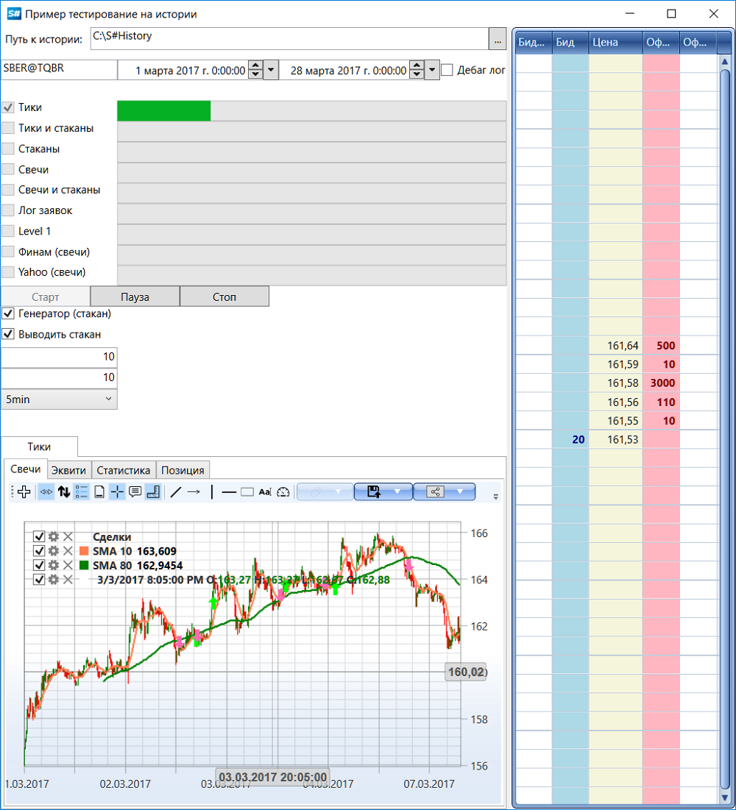

# На истории

Тестирование на исторических данных позволяет проводить как анализ рынка для поиска закономерностей, так и [оптимизацию параметров стратегии](optimization.md). Вся работа при этом заключена в классе [HistoryEmulationConnector](xref:StockSharp.Algo.Testing.HistoryEmulationConnector) (подробнее про [настройки тестирования](extended_settings.md)), который получает сохраненные в локальном хранилище данные через специальный [API](../market_data_storage/api.md). 

Тестирование идет по тиковым сделкам ([Trade](xref:StockSharp.BusinessEntities.Trade)) и стаканам ([MarketDepth](xref:StockSharp.BusinessEntities.MarketDepth)). Если на период в истории нет сохраненных стаканов, то они могут быть сгенерированы на основе сделок с помощью [MarketDepthGenerator](xref:StockSharp.Algo.Testing.MarketDepthGenerator) или восстановлены из ордерлога с помощью [OrderLogMarketDepthBuilder](xref:StockSharp.Algo.Testing.OrderLogMarketDepthBuilder).

Данные для тестирования на истории должны быть заранее скачаны и сохранены в специальном [S\#](../../api.md) формате. Это можно сделать самостоятельно, используя [Коннекторы](../connectors.md) и [Storage API](../market_data_storage/api.md), или настроить и запустить специальную программу [Hydra](../../hydra.md).

В дистрибутиве [S\#](../../api.md) находится пример SampleHistoryTesting (а также архив HistoryData.zip, где лежат исторические данные по тикам, стаканам и свечам, для примера), который тестирует стратегию [Cкользящая Cредняя](https://ru.wikipedia.org/wiki/Скользящая_средняя) на истории. Для сравнения скорости и качества, тестирование идет с различным набором маркет-данных:



## Основные этапы тестирования на истории

### 1. Настройка хранилища данных

Первым этапом необходимо создать объект [IStorageRegistry](xref:StockSharp.Algo.Storages.IStorageRegistry), через который [HistoryEmulationConnector](xref:StockSharp.Algo.Testing.HistoryEmulationConnector) будет получать исторические данные:

```csharp
// хранилище, через которое будет производиться доступ к тиковой и котировочной базе
var storageRegistry = new StorageRegistry
{
    // set historical path
    DefaultDrive = new LocalMarketDataDrive(HistoryPath.Folder)
};
```

> [!CAUTION]
> В конструктор [LocalMarketDataDrive](xref:StockSharp.Algo.Storages.LocalMarketDataDrive) передается путь к директории, где лежит история для **всех инструментов**, а не к директории с конкретным инструментом. Например, если архив HistoryData.zip был распакован в директорию *C:\\R\\RIZ2@FORTS\\*, то в [LocalMarketDataDrive](xref:StockSharp.Algo.Storages.LocalMarketDataDrive) необходимо передать путь *C:\\*. Подробнее, в разделе [API](../market_data_storage/api.md).

### 2. Создание инструментов и портфелей

```csharp
// создаем тестовый инструмент, на котором будет производиться тестирование
var security = new Security
{
    Id = SecId.Text, // sec id has the same name as folder with historical data
    Code = secCode,
    Board = board,
};

// тестовый портфель
var portfolio = new Portfolio
{
    Name = "test account",
    BeginValue = 1000000,
};
```

### 3. Создание эмуляционного коннектора

```csharp
// создаем шлюз для эмуляции
var connector = new HistoryEmulationConnector(
    new[] { security },
    new[] { portfolio })
{
    EmulationAdapter =
    {
        Emulator =
        {
            Settings =
            {
                // match order if historical price touched our limit order price. 
                // It is terned off, and price should go through limit order price level
                // (more "severe" test mode)
                MatchOnTouch = false,
                
                // комиссия для сделок
                CommissionRules = new ICommissionRule[]
                {
                    new CommissionPerTradeRule { Value = 0.01m },
                }
            }
        }
    },
    UseExternalCandleSource = emulationInfo.UseCandle != null,
    CreateDepthFromOrdersLog = emulationInfo.UseOrderLog,
    CreateTradesFromOrdersLog = emulationInfo.UseOrderLog,
    HistoryMessageAdapter =
    {
        StorageRegistry = storageRegistry,
        // set history range
        StartDate = startTime,
        StopDate = stopTime,
        OrderLogMarketDepthBuilders =
        {
            {
                secId,
                LocalizedStrings.ActiveLanguage == Languages.Russian
                    ? (IOrderLogMarketDepthBuilder)new PlazaOrderLogMarketDepthBuilder(secId)
                    : new ItchOrderLogMarketDepthBuilder(secId)
            }
        }
    },
    // set market time freq as time frame
    MarketTimeChangedInterval = timeFrame,
};
```

### 4. Подписка на события и настройка генерации данных

В событии получения нового инструмента задаем начальные значения Level1, регистрируем стакан или создаем и настраиваем генератор стакана. Также в зависимости от настроек регистрируем получение ордерлога и сделок:

```csharp
connector.NewSecurity += s =>
{
    if (s != security)
        return;
        
    // fill level1 values
    connector.HistoryMessageAdapter.SendOutMessage(level1Info);
    
    // подписываемся на нужные данные в зависимости от настроек тестирования
    if (emulationInfo.UseMarketDepth)
    {
        connector.SubscribeMarketDepth(security);
        
        // если нужно генерировать стаканы
        if (generateDepths || emulationInfo.UseCandle != null)
        {
            // if no have order book historical data, but strategy is required,
            // use generator based on last prices
            connector.MarketDataAdapter.SendInMessage(new GeneratorMessage
            {
                IsSubscribe = true,
                Generator = new RandomWalkTradeGenerator(new SecurityId { SecurityCode = security.Code })
                {
                    Interval = TimeSpan.FromSeconds(1),
                    MaxVolume = maxVolume,
                    MaxPriceStepCount = 3,    
                    GenerateOriginSide = true,
                    MinVolume = minVolume,
                    RandomArrayLength = 99,
                }
            });
        }
    }
    
    if (emulationInfo.UseOrderLog)
    {
        connector.SubscribeOrderLog(security);
    }
    
    if (emulationInfo.UseTicks)
    {
        connector.SubscribeTrades(security);
    }
    
    if (emulationInfo.UseLevel1)
    {
        connector.SubscribeLevel1(security);
    }
    
    // start strategy before emulation started
    strategy.Start();
    
    // создаем и подписываемся на серию свечей
    _series = new CandleSeries(typeof(TimeFrameCandle), security, timeFrame);
    connector.SubscribeCandles(series);
    
    // start historical data loading when connection established successfully and all data subscribed
    connector.Start();
};
```

### 5. Создание и настройка стратегии

```csharp
// создаем торговую стратегию, скользящие средние на 80 5-минуток и 10 5-минуток
var strategy = new SmaStrategy(chart, _candlesElem, _tradesElem, _shortMa, _shortElem, _longMa, _longElem, _series)
{
    Volume = 1,
    Portfolio = portfolio,
    Security = security,
    Connector = connector,
    LogLevel = DebugLogCheckBox.IsChecked == true ? LogLevels.Debug : LogLevels.Info,
    // by default interval is 1 min,
    // it is excessively for time range with several months
    UnrealizedPnLInterval = ((stopTime - startTime).Ticks / 1000).To<TimeSpan>()
};
```

### 6. Визуализация результатов

Для визуализации результатов тестирования можно подписаться на изменения P&L и позиции:

```csharp
// копируем параметры на визуальную панель
statistic.Parameters.Clear();
statistic.Parameters.AddRange(strategy.StatisticManager.Parameters);

var equity = set.Item6;
var pnlCurve = equity.CreateCurve(LocalizedStrings.PnL + " " + emulationInfo.StrategyName, emulationInfo.CurveColor, ChartIndicatorDrawStyles.Area);
var unrealizedPnLCurve = equity.CreateCurve(LocalizedStrings.PnLUnreal + emulationInfo.StrategyName, Colors.Black, ChartIndicatorDrawStyles.Line);
var commissionCurve = equity.CreateCurve(LocalizedStrings.Str159 + " " + emulationInfo.StrategyName, Colors.Red, ChartIndicatorDrawStyles.DashedLine);
var posItems = set.Item7.CreateCurve(emulationInfo.StrategyName, emulationInfo.CurveColor, ChartIndicatorDrawStyles.Line);

strategy.PnLChanged += () =>
{
    var pnl = new EquityData
    {
        Time = strategy.CurrentTime,
        Value = strategy.PnL - strategy.Commission ?? 0
    };
    var unrealizedPnL = new EquityData
    {
        Time = strategy.CurrentTime,
        Value = strategy.PnLManager.UnrealizedPnL ?? 0
    };
    var commission = new EquityData
    {
        Time = strategy.CurrentTime,
        Value = strategy.Commission ?? 0
    };
    
    pnlCurve.Add(pnl);
    unrealizedPnLCurve.Add(unrealizedPnL);
    commissionCurve.Add(commission);
};

strategy.PositionChanged += () => posItems.Add(new EquityData { Time = strategy.CurrentTime, Value = strategy.Position });
```

### 7. Запуск тестирования

```csharp
// запускаем эмуляцию
connector.Connect();
```

## Модернизированный пример тестирования на истории

В последних версиях [S#](../../api.md) пример тестирования на истории был модернизирован и теперь позволяет тестировать стратегию с использованием различных типов данных:

- Тики
- Стаканы
- Свечи различных таймфреймов
- Ордерлог 
- Level1
- Комбинации различных типов данных

Для каждого типа данных создается отдельная вкладка с графиками и статистикой:

```csharp
// create backtesting modes
_settings = new[]
{
    (
        TicksCheckBox,
        TicksProgress,
        TicksParameterGrid,
        // ticks
        new EmulationInfo
        {
            UseTicks = true,
            CurveColor = Colors.DarkGreen,
            StrategyName = LocalizedStrings.Ticks
        },
        TicksChart,
        TicksEquity,
        TicksPosition
    ),

    (
        TicksAndDepthsCheckBox,
        TicksAndDepthsProgress,
        TicksAndDepthsParameterGrid,
        // ticks + order book
        new EmulationInfo
        {
            UseTicks = true,
            UseMarketDepth = true,
            CurveColor = Colors.Red,
            StrategyName = LocalizedStrings.TicksAndDepths
        },
        TicksAndDepthsChart,
        TicksAndDepthsEquity,
        TicksAndDepthsPosition
    ),
    
    // ... другие комбинации типов данных
};
```

Такой подход позволяет легко сравнивать результаты работы стратегии при различных источниках данных.

## Расширенные настройки тестирования

Более подробно о дополнительных настройках тестирования, включая настройку генераторов стаканов, задержек исполнения заявок и других параметров, можно прочитать в разделе [Настройки тестирования](extended_settings.md).