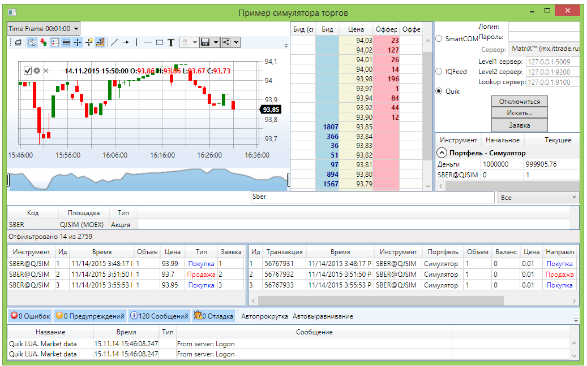

# На рыночных данных

Тестирование на рыночных данных представляет собой торговлю с реальным подключением к бирже ("живые" котировки), но без реального выставления заявок на биржу. Все регистрируемые заявки перехватываются, и их исполнение эмулируется на основе рыночных стаканов. Такое тестирование может быть полезно, например, если разрабатывается торговый тренажер, или необходимо проверить торговый алгоритм на краткосрочном отрезке времени с реальными котировками.

Для эмуляции торговли на реальных данных необходимо использовать [RealTimeEmulationTrader\<TAdapter\>](xref:StockSharp.Algo.Testing.RealTimeEmulationTrader`1), который выполняет роль "обертки" коннектора конкретной торговой системы ([Binance](../connectors/crypto_exchanges/binance.md), [Tinkoff](../connectors/russia/tinkoff.md) и т.п.).

## Создание эмуляционного коннектора

Для создания эмуляционного коннектора нужно сначала создать обычный коннектор для получения рыночных данных, а затем на его основе создать эмуляционный:

```csharp
// Создаем обычный коннектор для получения рыночных данных
private readonly Connector _realConnector = new();

// Создаем эмуляционный коннектор
_emuConnector = new RealTimeEmulationTrader<IMessageAdapter>(_realConnector.Adapter, _realConnector, _emuPf, false);

// Настраиваем параметры эмуляции
var settings = _emuConnector.EmulationAdapter.Emulator.Settings;
settings.TimeZone = TimeHelper.Est;
settings.ConvertTime = true;
```

Для эмуляции торговли необходимо использовать специальный портфель:

```csharp
private readonly Portfolio _emuPf = Portfolio.CreateSimulator();
```

## Подписка на события

Как и обычный коннектор, эмуляционный коннектор генерирует события при получении рыночных данных и выполнении транзакций:

```csharp
// Подписываемся на события коннектора
_emuConnector.Connected += () =>
{
	// update gui labels
	this.GuiAsync(() => { ChangeConnectStatus(true); });
};

_emuConnector.Disconnected += () =>
{
	// update gui labels
	this.GuiAsync(() => { ChangeConnectStatus(false); });
};

_emuConnector.ConnectionError += error => this.GuiAsync(() =>
{
	// update gui labels
	ChangeConnectStatus(false);
	MessageBox.Show(this, error.ToString(), LocalizedStrings.Str2959);
});

_emuConnector.OrderBookReceived += OnDepth;
_emuConnector.PositionReceived += (sub, p) => PortfolioGrid.Positions.TryAdd(p);
_emuConnector.OwnTradeReceived += (s, t) => TradeGrid.Trades.TryAdd(t);
_emuConnector.OrderReceived += (s, o) =>
{
	if (!_fistTimeOrders.Add(o))
		return;

	_bufferOrders.Add(o);
	OrderGrid.Orders.Add(o);
};

// Подписываемся на ошибки регистрации заявок
_emuConnector.OrderRegisterFailReceived += (s, f) => OrderGrid.AddRegistrationFail(f);

_emuConnector.CandleReceived += (s, candle) =>
{
	if (s == _candlesSubscription)
		_buffer.Add(candle);
};
```

## Подписка на маркет-данные

Для работы с рыночными данными необходимо подписаться на соответствующие типы данных:

```csharp
// Подписываемся на стаканы, тики и Level1 для эмуляционного коннектора
_emuConnector.Subscribe(new(DataType.MarketDepth, security));
_emuConnector.Subscribe(new(DataType.Ticks, security));
_emuConnector.Subscribe(new(DataType.Level1, security));

// Подписываемся на стаканы для реального коннектора (нужны для эмуляции)
_realConnector.Subscribe(new(DataType.MarketDepth, security));

// Подписываемся на свечи
_candlesSubscription = new(CandleDataTypeEdit.DataType, security)
{
	From = DateTimeOffset.UtcNow - TimeSpan.FromDays(10),
};
_emuConnector.Subscribe(_candlesSubscription);
```

## Регистрация и управление заявками

Заявки регистрируются через эмуляционный коннектор аналогично обычному коннектору:

```csharp
// Регистрация заявки
_emuConnector.RegisterOrder(order);

// Отмена заявки
_emuConnector.CancelOrder(order);

// Замена заявки
_emuConnector.ReRegisterOrder(order, newPrice, order.Balance);
```

## Настройка параметров эмуляции

Для настройки параметров эмуляции можно использовать свойство [MarketEmulatorSettings](xref:StockSharp.Algo.Testing.MarketEmulatorSettings):

```csharp
var settings = _emuConnector.EmulationAdapter.Emulator.Settings;

// Установка временной зоны
settings.TimeZone = TimeHelper.Est;

// Конвертация времени
settings.ConvertTime = true;

// Удовлетворять заявки при касании цены
settings.MatchOnTouch = false;

// Эмуляция задержки исполнения заявок
settings.Latency = TimeSpan.FromMilliseconds(100);
```

## Пример интерфейса

Пример SampleRealTimeEmulation демонстрирует возможность одновременного отображения данных как от реального коннектора, так и от эмуляционного:



Интерфейс приложения содержит следующие элементы:
- Графики для отображения свечей и заявок
- Таблицы заявок и собственных сделок
- Стаканы реального рынка и эмуляционного стакана
- Элементы управления для создания и отмены заявок

## Преимущества и ограничения

Тестирование на рыночных данных имеет следующие преимущества:
- Использование реальных рыночных данных без финансовых рисков
- Проверка алгоритмов в условиях, максимально приближенных к реальной торговле
- Возможность сравнения результатов с реальным рынком в реальном времени

Ограничения:
- Скорость тестирования ограничена скоростью поступления реальных данных
- Невозможность тестирования на исторических периодах
- Зависимость от качества и полноты получаемых маркет-данных